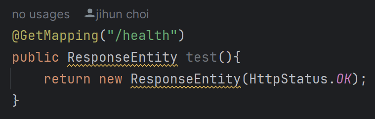
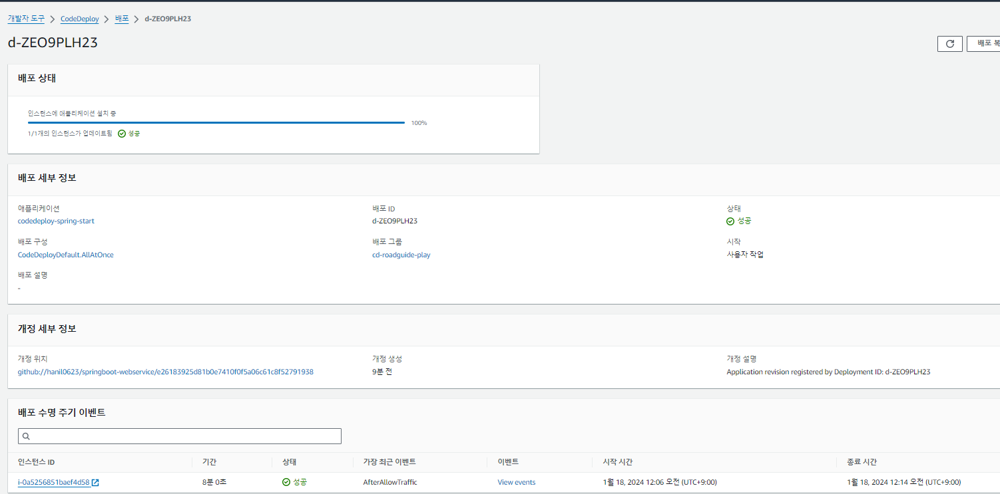
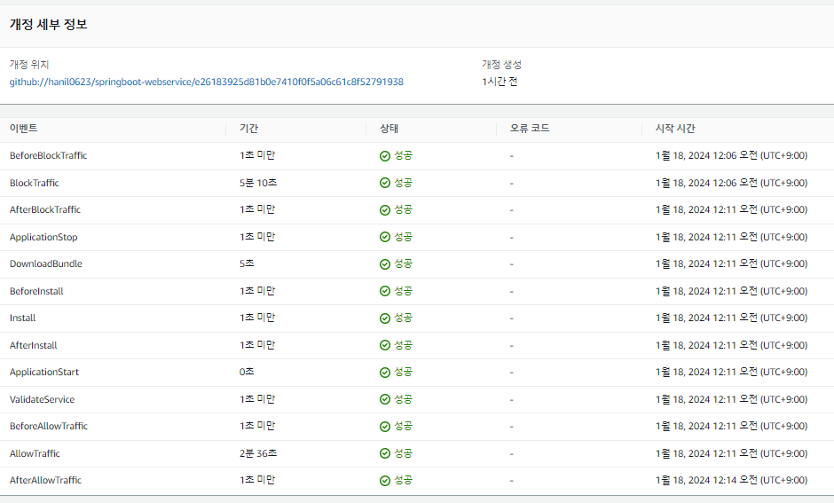

### 240118

#### CodeDeploy 배포 에러 해결

Cannot reach InstanceService: Aws::CodeDeployCommand::Errors::AccessDeniedException

원인 : EC2 서버 내 기존 AWS 자격 증명 파일이 있어 IAM 정보를 제대로 가져오지 못해 접근 불가 발생

해결 : AWS 자격증명 파일 삭제 및 재시작

> sudo rm -rf /root/.aws/credentials

> sudo systemctl restart codedeploy-agent

그 외 codedeploy 명령어

1. codedeploy 상태 확인
> sudo service codedeploy-agent status

2. codedeploy 시작
> sudo service codedeploy-agent start

로그 위치 : /var/log/aws/codedeploy-agent/codedeploy-agent.log

참조 : https://velog.io/@gingaminga/AwsCodeDeployCommandErrorsAccessDeniedException

2-1. Deploy가 성공하려면 Health Check 통과해야한다.
 - /health 들어올 때 200 OK를 뱉도록 소스 수정이 필요하다.

 

3. 배포 성공!

#### Next : JNI + Spring 엮어 배포 가능 여부 확인, k8s 기초 강의 듣기!