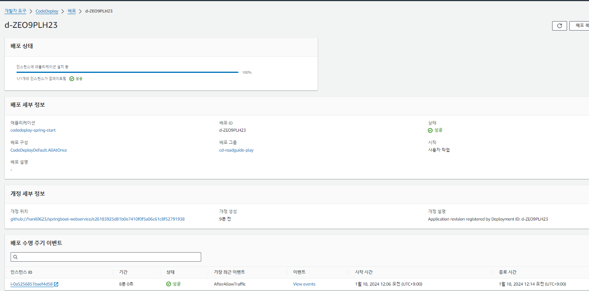

## CodeDeploy

 > 이 페이지는 업무 적응을 위해, AWS Cloud 내 CodeDeploy(자동 배포)로 Spring Project 배포한 개인 프로젝트 기록을 남기는 페이지입니다.

 1. Github와 연동하여, 커밋을 CodeDeploy에 등록하면 업데이트 시, 해당 커밋의 내용이 반영된다.

 

 2. CodeDeploy 배포 성공!

 