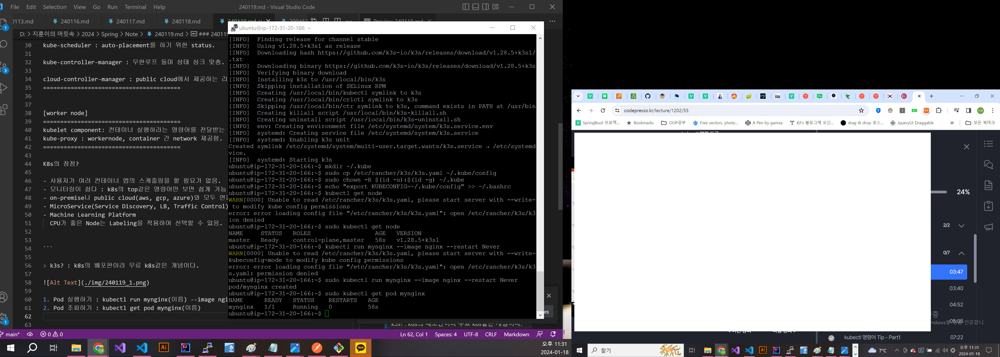
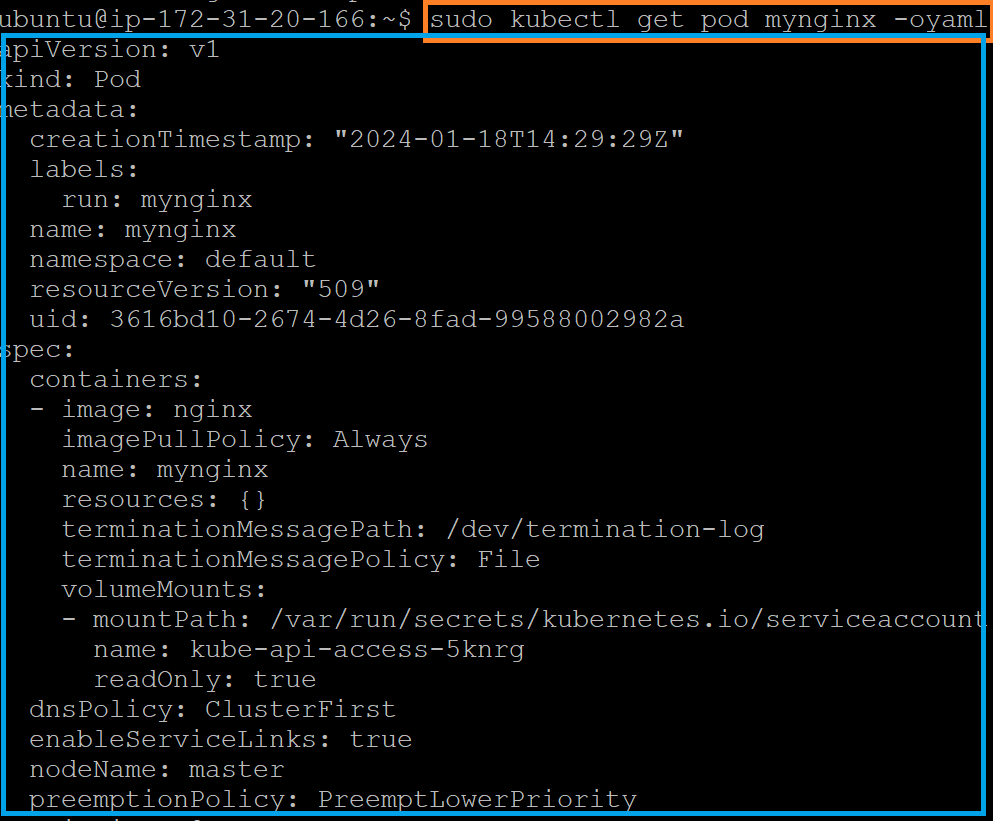
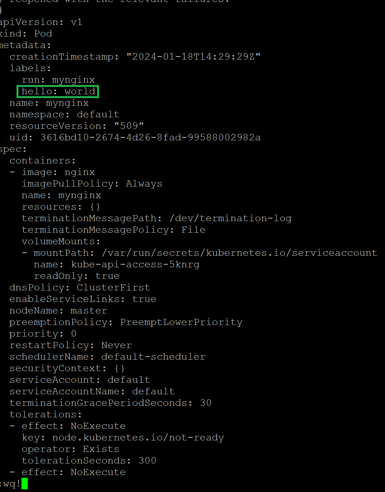

### 240119

Kubernetes 기초 강의

```
- k8s는 오픈소스이며, 구글이 만들었다.

- 주요 용어는 docker-compose, orchestration이 있다.
 docker-compose : Web Server, DB, WAS를 하나의 덩어리로 생각하는 개념.
 Orchestration : Multi container on multi host (자세힌 몰라)

- Docker Orchestration이 지원하는 기능
> Clustering, Auto-placement(어떤 서버가 어떤 컨테이너에 위치할 것인가), Auto-restart(자동배포), 무중단배포

- k8s엔 Worker와 Master Server 개념이 존재하며, Namespace 개념도 존재한다.

- 주요 리소스 : Pods, Node, Service

- YAML 파일로 Pod를 정의하는 방식이며, k8s는 YAML파일(앱 정의서)를 읽고 그대로 만들어 준다.

```

```
[Master Node]
=======================================
kube-api-server라는게 masternode에 있고 모든 node와 소통함.

etcd : Key-Value 형태의 DB임.

kube-scheduler : auto-placement를 하기 위한 status.

kube-controller-manager : 무한루프 돌며 상태 싱크 맞춤.

cloud-controller-manager : public cloud에서 제공하는 리소스를 핸들링하는 곳.
========================================


[worker node]
========================================
kubelet component: 컨테이너 실행하라는 명령어를 전달받는 것.
kube-proxy : workernode, container 간 network 제공함.
========================================

K8s의 장점?

- 사용자가 여러 컨테이너 앱의 스케줄링을 할 필요가 없음.
- 모니터링이 쉽다 : k8s의 top같은 명령어만 보면 쉽게 가능.
- on-premise나 public cloud(aws, gcp, azure)와 모두 연동 가능
- MicroService(Service Discovery, LB, Traffic Control)기능 내장.
- Machine Learning Platform
  CPU가 좋은 Node는 Labeling을 적용하여 선택할 수 있음.


```

> k3s? : k8s의 배포판이라 무료 k8s같은 개념이다.



1. Pod 실행하기 : kubectl run mynginx(이름) --image nginx --restart Never
2. Pod 조회하기 : kubectl get pod mynginx(이름) - **자주사용**
3. Yaml 정의서 확인 : kubectl get pod mynginx -oyaml
 - yaml 화면
 

4. Pod 상태확인 : kubectl describe pod mynginx - **자주사용**
5. Pod 명령전달 : kubectl exec mynginx -- apt update 
                 // kubectl exec mynginx -- apt install -y curl

6. 컨테이너의 로그확인 : kubectl logs mynginx
7. 로컬 호스트 - Pod 간 파일 복사
 > kubectl cp ~/.bashrc mynginx:/. (호스트의 bashrc 파일을 container(mynginx) 안으로 집어넣을 수 있다)

8. Container - 로컬 호스트 간 파일 복사
 > kubectl cp mynginx:/etc/passwd . (mynginx의 passwd 파일을 호스트 서버로 복사)

9. Pod(yaml 파일) 수정하기 : kubectl edit pod mynginx


10. Pod 삭제 : kubectl delete pod mynginx

11. 네임스페이스 주기 : kubectl get pod --namepsace {kube-system}
 - kube-system이라는 namespace의 pod를 listing 하겠다는 의미.

12. 노드에 라벨 부여 : kubectl label node master color=red

13. kubectl api-resources (namespace, pod, node 말고 다른거 보기)

14. 특정 yaml 파일 내부 json Value값 표출하기
 > kubectl get pod mynginx -o jsonpath="{ .spec.containers[0].image}"

15. kubectl 자동완성 커맨드 : echo "source <(kubectl completion bash)" >> ~/.bashrc

16. ~/.kube/config : IAM Role같이 클라이언트가 k8s에 접속하기 위한 설정파일, 킷값, 인증 등 들어가 있는 공간. (k8의 default port : 6443)

17. 클러스터 상태 체크 : kubectl cluster-info

#### Kubernetes 기초 활용부터, Pod 부터 내용 보기!


