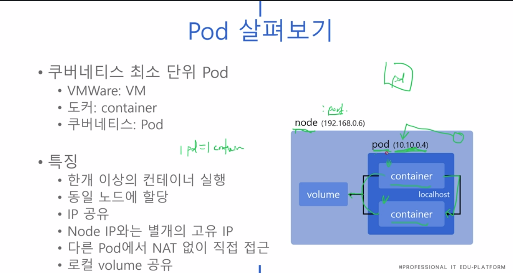
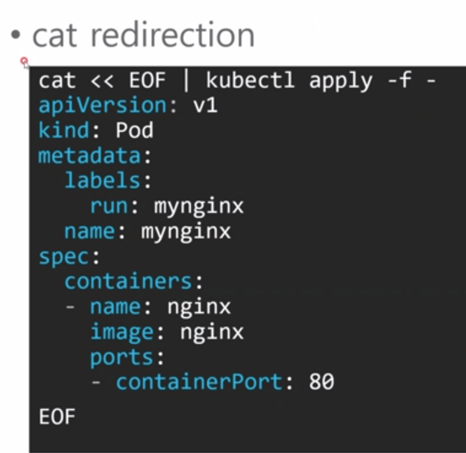

### 240120

Kubernetes 기초 강의 (2)

1. 내 k8s가 정상동작인지 확인
> kubectl cluster-info

What is Pod?

 > docker는 container가 최소단위, k8s에선 Pod가 최소단위임.

 - 1 pod = 1 container (보통) 실행, 

 - 동일 노드에 할당되며, IP 공유한다.

 - 

2. 앱 정의서를 Pod에 적용 : kubectl apply -f mynginx.yaml

3. 

4. 라벨링 시스템을 통해, 특정 노드에 나의 파드를 배치시킬 수 있음
  - kubectl label node master disktype=ssd

5. k8s엔 Volume이라는 저장소 개념이 있다. 이 역시도 yaml 파일에 정의됨.

[my-volume.yaml]
```
apiVersion: v1
kind: Pod
metadata:
  name: mynginx
spec:
  containers:
  - name: mynginx
    image: nginx
    volumeMounts:
    - mountPath: /test-volume
      name: my-volume
    volumes:
    - name: my-volume
      hostPath:
        path: /home
        type: Directory
```

6. Pods에 매개변수 전달 가능한 yaml 파일 내부 property : command, args

7. configMap이라는 개념을 yaml 정의서에 적어주면, Pod와 properties(임의의 config값)을 연결시켜줄 수 있다.
 - configMounts라는게 뭔지 잘 모르겠는데.. 추가 검색 필요
 - 어떤 정보를 Pod에 넘겨주는 방법같은 개념..? args라던가 등등.

관련 키워드 : configMap, volumeMounts.


8. k8s가 리소스 관리가 편한 이유는? yaml 파일 안에 Pod가 얼마나 많은 용량을 사용할지 등 이런걸 다 정의할 수 있기떄문.

```
spec 안에 resources 필드가 있다.

resources:
  requests: // Pod의 최소 크기 설정 가능
    cpu: "250m" // 1000m = 1Core
    memory: "500Mi"
  limits: // Pod의 최대 사용량 관리 가능
    cpu: 500m
    memory: 1G
```

9. 여러 컨테이너를 어떻게 실행할까?
 - 한 yaml 안에 정의된 여러 Pod끼린 localhost로 통신이 가능하다.
 - 한 Pod에 nginx 두고 다른 Pod에 Curl 날리게 하면 서로 통신이 되니까 가능하다는 소리.


#### Pod 개념 계속 보기..
