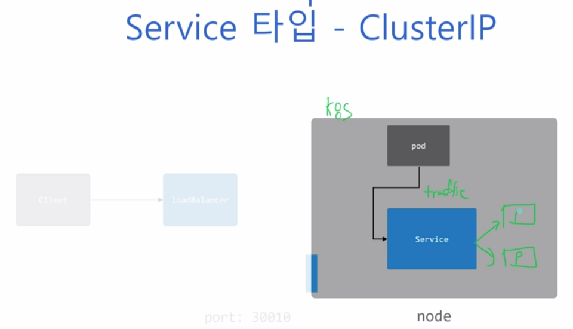
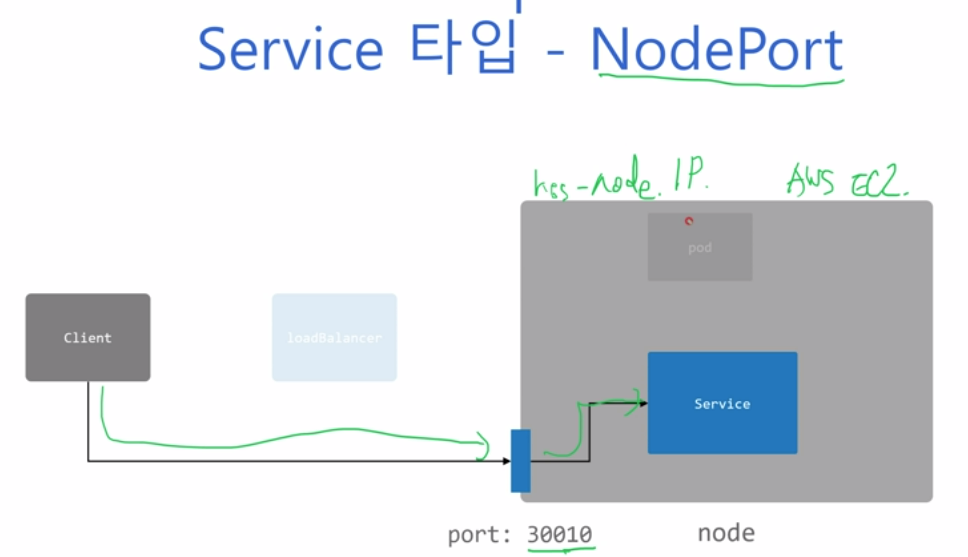
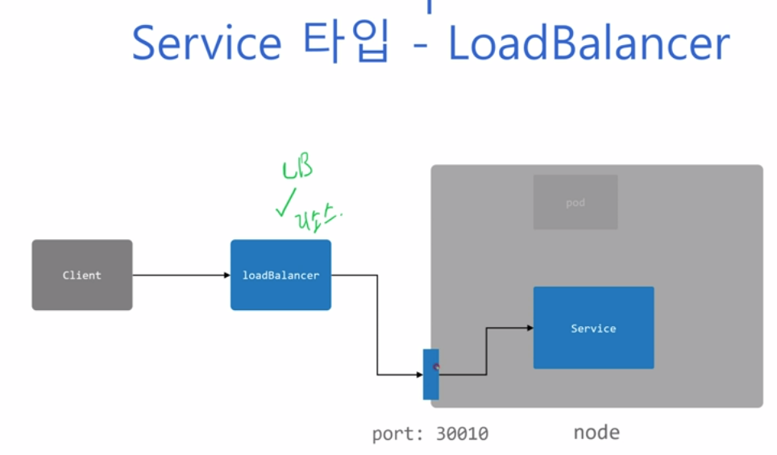

### 240124

#### 여러가지 Service의 타입 정리

 - ClusterIP : cluster 내부 통신 시 kind를 Service라 생성 (cluster의 트래픽만 Service가 받을 수 있음)
  
 - ServiceDiscovery : mynginx라는 이름을 내부 ClusterIP와 매칭시켜주는 것.
 - NodePort : 외부에서 Service로 전달 가능함. (30000~32767)
  
 - LoadBalancer : Node 앞단에 붙어 부하분산, ReverseProxy 가능하게 함.
 - ExternalName : 외부 도메인 이름을 alias로 할 수 있다. 마치, 클러스터 내부에서 바깥 DNS 접속(google.com)하기 위해 설정 
  

#### k8s 네트워크 모델
 - Node간 NAT(Network Address Translation) 없이 통신 가능
 - Pod간 NAT 없이 통신
 - Pod와 Node도 NAT 없이 통신
 - 각 Pod는 ip가 있으며, IP Routing을 통해 통신가능해야 한다.
