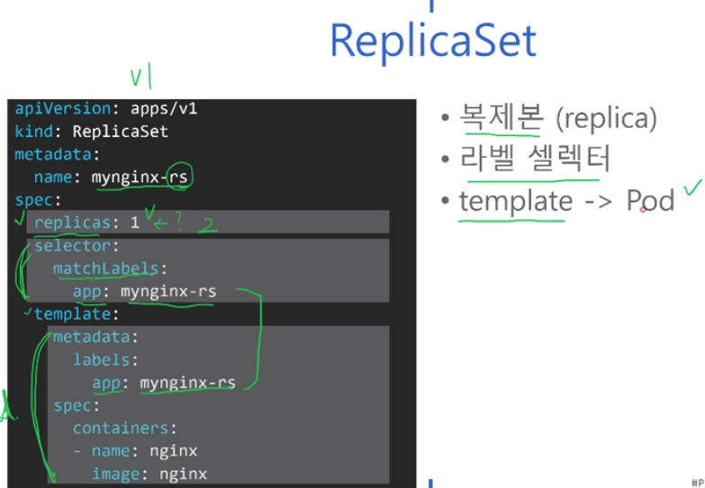
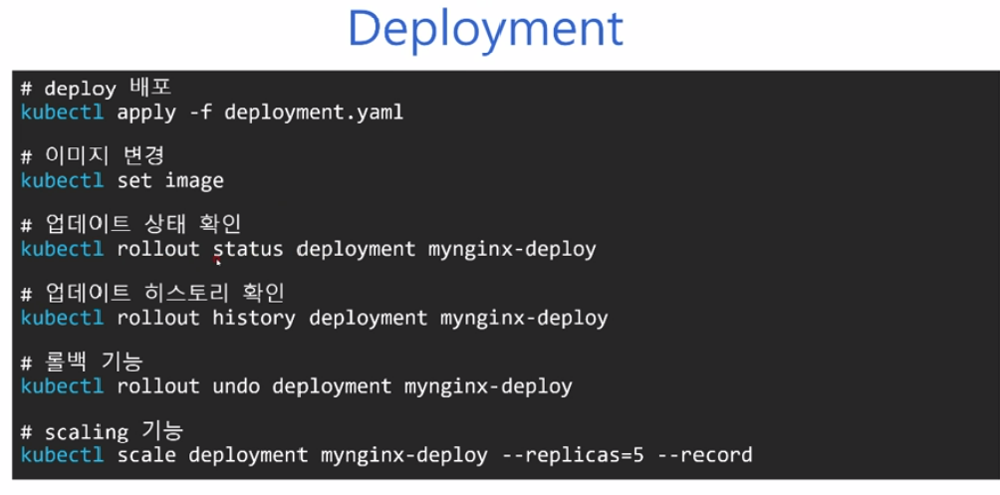

### 240125

#### ReplicaSet

 - 마치 AMI 복제와 같은 개념이다.
 - 

#### Deployment

 - Pod가 새로 배포되었다 할때 버전관리나 배포전략 같은것들을 보관하는 리소스

```
Deployment_Example.yaml

apiVersion: apps/v1
kind: Deployment
metadata:
  name: mynginx-deploy
spec:
  replicas: 5
  strategy:
    type: RollingUpdate
    rollingUpdate:
      maxUnavailable: 25% // 최대 몇개의 Pod가 종료되도 되는지?
      maxSurge: 25% // 최대 몇개의 Pod가 초과해도 되는지?
    selector: ↓아래는 기존 ReplicaSet과 동일함 ↓
      matchLabels:
        app: nginx // nginx Pod를 배포관리 하겠다.
    template: // 아래는 Pod 정의와 동일함. 
      metadata:
        labels:
          app: nginx
        spec:
          containers:
          - name: nginx
            image: nginx:1.7.9
```



#### DaemonSet

 - 모든 노드에 일괄적용이 필요한 경우 사용함 (로그 작업때 자주 사용하는 느낌?)

#### Job

 - 1회성 배치작업에 사용

#### Secret

 - 암호화 데이터 저장할때 사용
 

