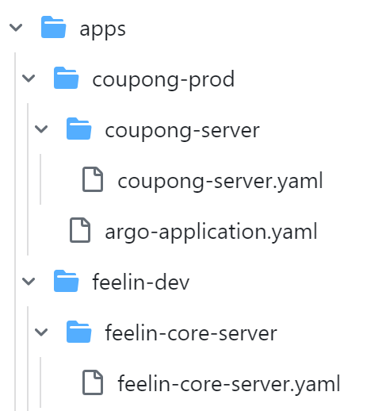
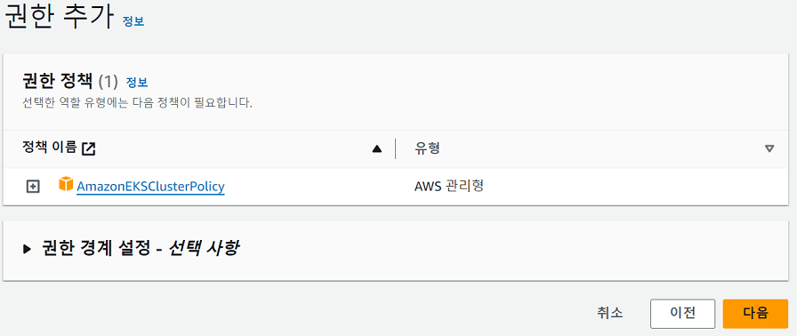
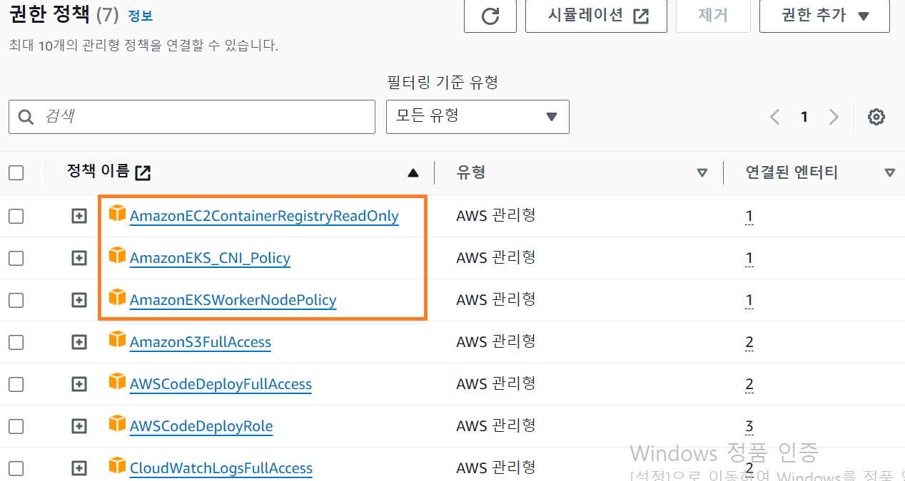
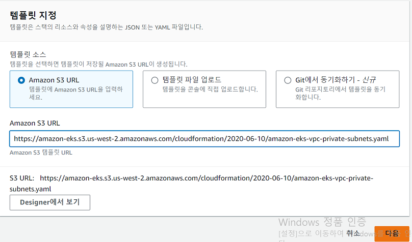
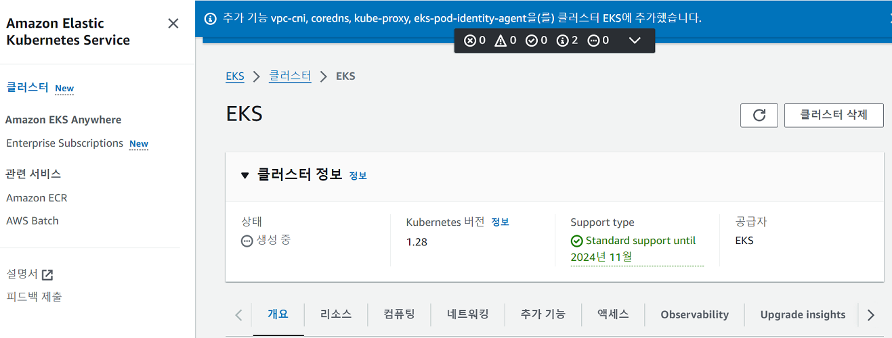

#### 240128

Kubernetes 사용 용어 공부

1. k8s의 단위

> Cluster > Node > Pod > Container

Cluster = (Master Node) + (Worker Node)
 - Master Node : k8s 시스템 관리용 노드, Control Plane 관장 (보통 3개정도 띄워놈)
 - Worker Node : 실제 배포하고자 하는 앱 실행, Data Plane 이라고 불린다.

Control Plane
 - 현재 Cluster 상태를 사용자가 정의한 앱 정의서(yaml)의 상태로 끊임없이 조정해 주는 컨트롤 센터.
 - 여기서 어떤 Worker Node에 Pod 배정할 것이며, Pod의 CPU, 메모리를 결정하는 역할.
 - 즉, EC2 = Node라고 봐도 된다. 내부 Nginx는 Pod같은 느낌.

2. Cluster Endpoint Access 설정

 - EKS 생성 시 Cluster endpoint access를 선택할 수 있다. (Public or Private)
 - Public : control plane이 Public에 위치하며, kubectl 명령어를 내 PC에서 사용할 수 있게 된다.
 - Private : kubectl 명령어를 로컬이 아닌 EC2에서만 (같은 VPC 내) 사용 가능하게 될 것인가 설정한다.

3. Node Group 설정

 - AMI와 비슷한 개념이다. EKS에서 각 Node(EC2)를 생성하는 템플릿에 가까움.
 - 우리 AutoScaling 시 AMI 따서 만들듯, EKS에선 Node들이 만들어진다.
 - Ingress (서비스 요청이 우리 Cluster로 인입)되는걸 설정하려면 ALB + NodePort 설정이 필요한 것은 알겠다.

> 번외 : AZ마다 NAT를 구축하는 것이 일반적이며, NAT 비용은 비싸다..
> 번외2 : NAT의 inbound에 private subnet 대역 추가해야 나갈 수 있다. 조심!
> 번외3 : Argo CD는 infra 상태 기술 파일(yaml 등)을 자동반영 및 상태관리할 수 있는 도구이며, K8S에 대해 좀더 쉽게 할 수 있다.

> 번외4 : 앱 정의서(yaml)을 이런식으로 폴더로 관리하는구나.. 신기!

> 번외5 : OIDC(OpenID Connect) : EKS의 Cluster ↔ AWS Resource(EC2, S3 등) 인증 가능하게 하는 OAuth 2.0 기반 인증 레이어.

4. Label vs Annotations
 - Label : 사용자가 원하는 데이터대로 Key-value로 정의 가능
 - Annotations : K8S 시스템이 이해할 수 있는 용어로 정의

------------------

## EKS 사용 Cluster 구축하기

1. AWS-CLI, Kubectl설치 하기
2. EKS Cluster를 위한 IAM Role 생성
   

3. EKS는 클러스터 생성 서비스이고, 워커노드는 EC2이기에, EC2 IAM Role 생성
 - 기존 생성된 것 이외에 EKS를 위한 추가 규칙 필요
 

4. EKS에 사용되는 VPC 생성을 위해, CloudFormation Stack 사용
 

5. EKS Cluster 생성
 

6. Kubeconfig 생성 - 다음시간에..

참조 : https://potato-yong.tistory.com/126?category=853010

------------------
### 인증서 인증 과정에 대한 기록 필수..!
