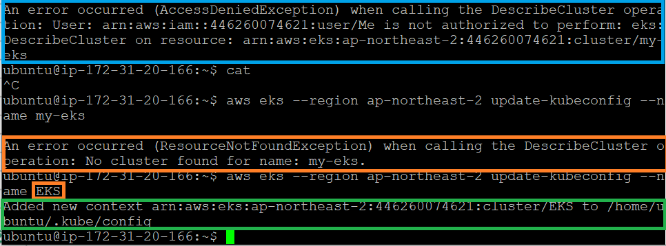
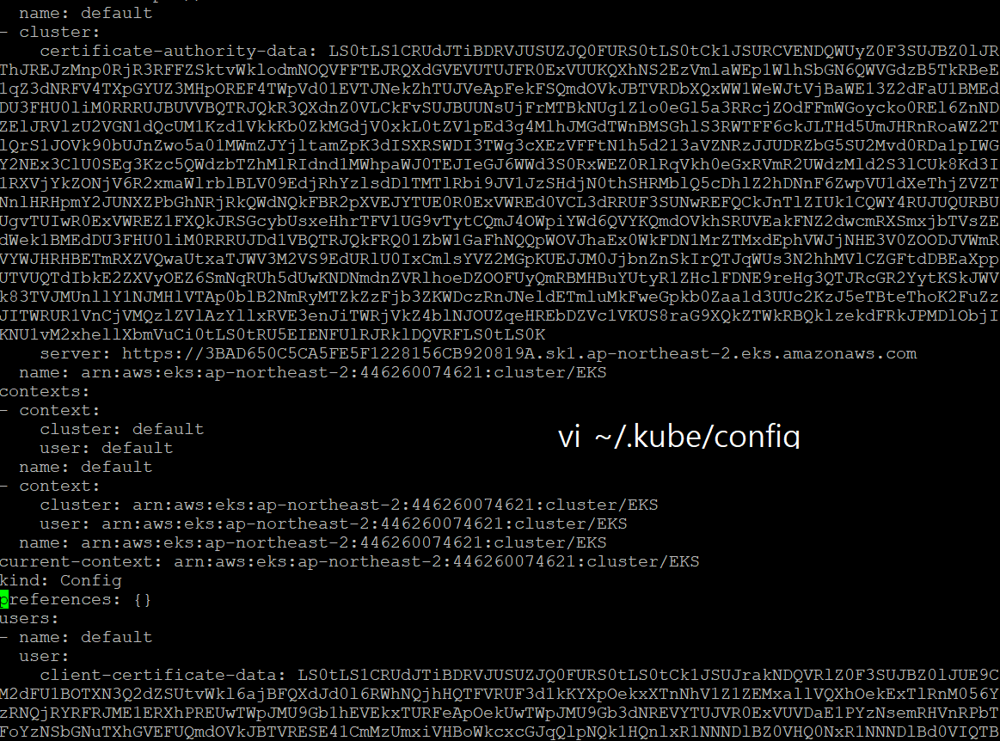

### 240129

EKS 버그 분투중

이게 Console에 생성한 EKS Name을 EC2 Config에 연결하는 느낌이다.

EKS Cluster에 Node 연결하면 kubectl 명령어가 먹통이다. 왜그럴까..? VPC 설정 때문인가..

이 블로그로 바꿔보자 : https://velog.io/@imsooyeon/aws-EKS-%EA%B5%AC%EC%84%B1%ED%95%98%EA%B8%B0

