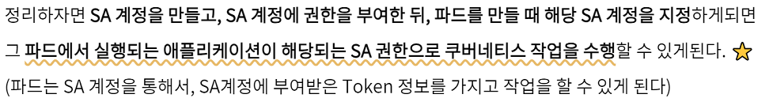
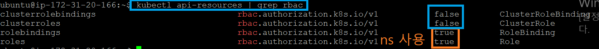
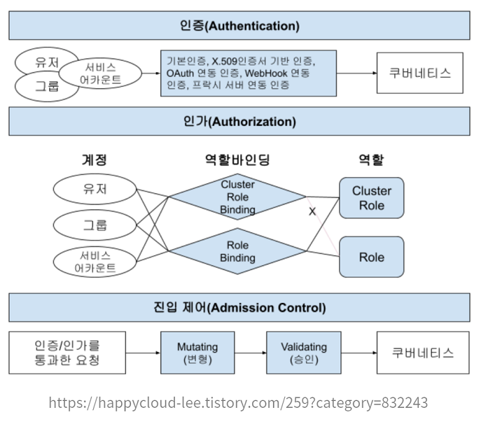

#### 240201

### k8s RBAC 인증 예제

출처 : https://nayoungs.tistory.com/entry/Kubernetes-RBAC-%EB%B0%8F-%EC%9D%B8%EC%A6%9D

#### 1. Service Account

- SA(Service Account) : k8s가 관리하는 사용자로, 사용자가 아닌 Pod가 사용한다.

- 기본적으로 Pod 생성 시, SA가 default로 생성됨
 > kubectl get pod <POD> -o yaml 

- 기본 볼륨에 이 SA 계정의 Token 정보가 들어가 있다.
 > kubectl describe pod <POD> | grep Mounts
- SA 계정의 Token 위치가 위 Mount에 있다.



#### 2. Normal User

- k8s가 관리하지 않는 일반 사용자, 이 사용자는 보통 API Call을 할 수 없다.

- 추가하려면, 사용자가 CA 인증서를 갖고 있으면 가능.

> JWT = Json Web Token

#### RBAC

- 개별 사용자의 "역할"에 따라 컴퓨팅 리소스의 액세스를 규제하는 인가(Authorization) 방식이다.



#### Role, ClusterRole

- Role : 특정 namespace에 한정된 정책
- ClusterRole : Cluster 전체 한정된 정책
- RoleBinding : 역할이 특정 namespace에 한정된 정책을 따르도록 적용, 쉽게말하면 Role과 SA/User를 연결시켜준다고 생각하자.
- ClusterRoleBinding : Cluster 전체에 한정된 정책을 SA/User와 연결.

> K8S 내 인증/인가 처리 방식



------------------------

- 실습 1. ServiceAccount 만들기
 > kubectl create sa myuser1
 > kubectl get sa
 > kubectl describe sa myuser1
 = SA는 k8s가 관리하는 영역이니까 자기의 토큰이 있음. 이 토큰 정보는 secret 리소스에 저장된다.
 > kubectl get secret

 - 실습 2. 임의의 인증서(x509)를 만들고, Role 부여

 > openssl genrsa -out myuser.key 2048
 > openssl req -new -key myuser.key -out myuser.csr -subj "/CN=myuser"
  = 내 RSA 키(myuser.key)로, k8s CA에 요청할 수 있는 요청서(.csr)를 만들어라!

 - 인증서 요청할 정의서
```
csr.yaml

apiVersion: certificates.k8s.io/v1
kind: CertificateSigningRequest
metadata:
  name: myuser-csr
spec:
  usages: #사용 용도 -> 여러개 지정 가능
  - client auth #클라이언트 인증
  signerName: kubernetes.io/kube-apiserver-client #서명하는 사람, 서명하는 이름
  request: LS0tLS1CRUdJTiB... #인코딩 결과 붙여넣기
```
 > kubectl create -f csr.yaml
 > kubectl certificate approve myuser-csr // 인증

#### 24. 02. 01
 - 추가 참조 필요
 - A. https://kingofbackend.tistory.com/209
 - B. https://support.bespinglobal.com/ko/support/solutions/articles/73000544846--aws-eks-%ED%99%98%EA%B2%BD%EC%97%90%EC%84%9C-rbac-%EC%A0%81%EC%9A%A9%ED%95%98%EA%B8%B0
 - C. https://velog.io/@viewrain/%EA%B6%8C%ED%95%9C-%EA%B4%80%EB%A6%AC-%EC%A0%91%EA%B7%BC%EC%A0%9C%EC%96%B4-%EB%AC%B4%EC%97%87%EC%9D%B4-%EC%9E%88%EA%B3%A0-%EC%96%B4%EB%96%BB%EA%B2%8C-%ED%95%A0%EA%B9%8C

