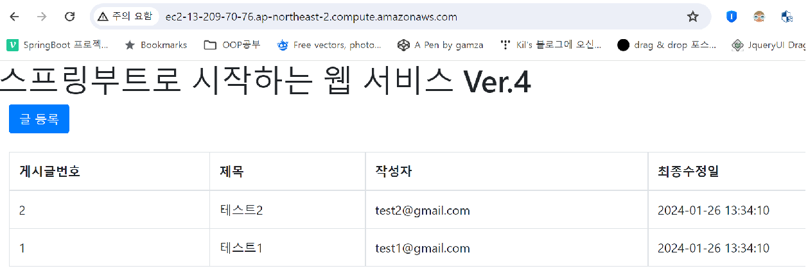
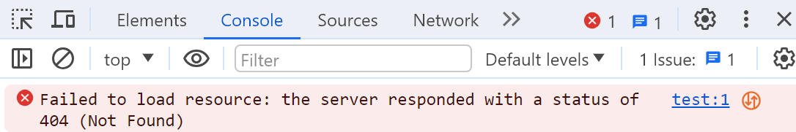

#### 240126

# Nginx 명령어 공부

Nginx는 부하 분산 및 reverse-proxy를 목적으로 만든 Web Server이다.

1. resolver {ip} : 어떤 통신사의 DNS 서버를 이용할 것인지 설정한다.
2. listen {port} : 특정 port로 들어오는 모든 요청을 수신하겠단 의미이다.
3. root html : nginx의 root 경로에 html을 출력하겠다는 의미로 보임.
4. nginx proxy의 기본 문법
 ※ include /etc/nginx/sites-enabled/* 내용을 삭제해야 아래 프록시가 먹힌다.※
 
```

http {
    include mime.types; ## 웹브라우저 지원 타입을 사용. 바이너리 파일이라면 포함 필수, (ASCII로 열리지 않음)
    default_type application/octet-stream; ## 8비트 단위의 Contents-Type이며, 이 파일을 다룰 마땅한 실행 프로그램은 없다. 바이너리니까..
    keepalive_timeout 0; ## 소켓연결 종료 후, 일정시간 동안 소켓을 유지해주는 것.

    upstream localhost { # proxy_pass와 일치해야함. 이때 부하분산 하는 설정임
        least_conn; ## 연결된 접속자가 가장 적은 쪽으로 분배함.
        keepalive n초; # n초간 소켓이 열려있음.

        # 아래는 개수만큼 서버 ip나 port로 분배하겠다는 뜻임
        server {서버 ip}:{port} max_fails=n초, fail_timeout=n초
        server {서버 ip2}:{port2} max_fails=n초, fail_timeout=n초
    }

    server {
        listen 80; ## 80포트로 유입될 때
        location / { ## / url이면
            proxy_pass http://localhost:8080; ## 8080포트로 프록시 하라
        }
        location /internalTest { ## 해당 url 요청이면
            internal; ## 404 Not Found 에러 반환한다.
        }

        location = / { include Temp.conf } # 요청 인입 시, Temp.conf 설정을 읽어 사용하겠다는 의미.

        charset utf-8; ## 한글 깨지지 않기 위해 utf-8로 변환
    }

    # nginx에서 healthCheck도 가능하다.
    location = /healthCheck {
        # 특정 파일이 떠있는지 보고 healthCheck_OK 판단하는 방법.
        set $health_chk /home/healthCheck_OK;
        if (-f $health_chk) { return 200; }
        return ERROR_CODE;
    }
}
```




### 내일은 nginx의 버퍼 이슈 관련 정리하기.


