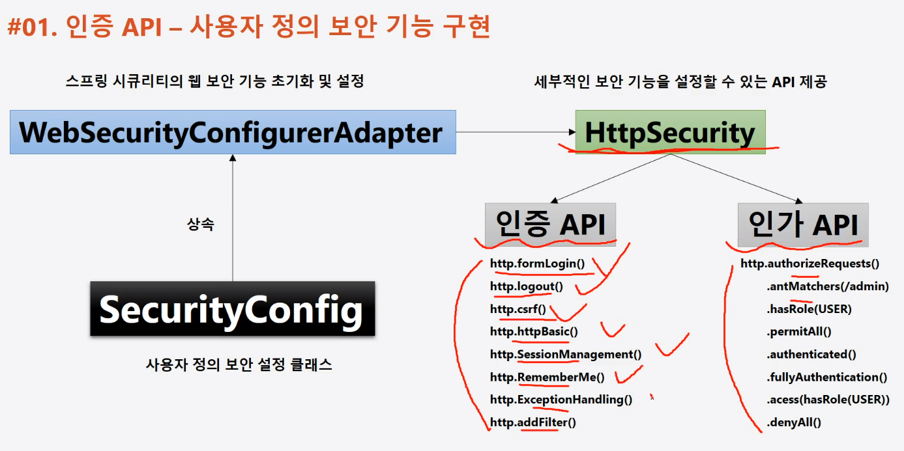

#### 240205

1. 결국 아래 API를 Override해서 입맛에 맞게 사용한다.


2. Spring 3.0버전부터 이전버전과 다른 부분이 많다.

As-is : WebSecurityConfigurerAdapter 상속받아 Override

To-be : 상속받지 않고 Bean 등록하여 사용

As-is
```
public class SecurityConfig extends WebSecurityConfigurerAdapter {
    @Override
    protected void configure(HttpSecurity http) throws Exception {
        http.authorizeRequests()
        .anyRequest().authenticated();
        http.formLogin();
    }
}
```

To-be : SecurityFilterChain을 Bean으로 등록
```
@Configuration
@EnableWebSecurity // 웹 보안 활성화
public class SecurityConfig {
    @Bean
    protected SecurityFilterChain filterChain(HttpSecurity http) throws Exception {
        http
                .authorizeRequests()
                .anyRequest().authenticated();
        http
                .formLogin(Customizer.withDefaults());
        return http.build();
    }
}
```

참조 : https://velog.io/@pjh612/Deprecated%EB%90%9C-WebSecurityConfigurerAdapter-%EC%96%B4%EB%96%BB%EA%B2%8C-%EB%8C%80%EC%B2%98%ED%95%98%EC%A7%80

###