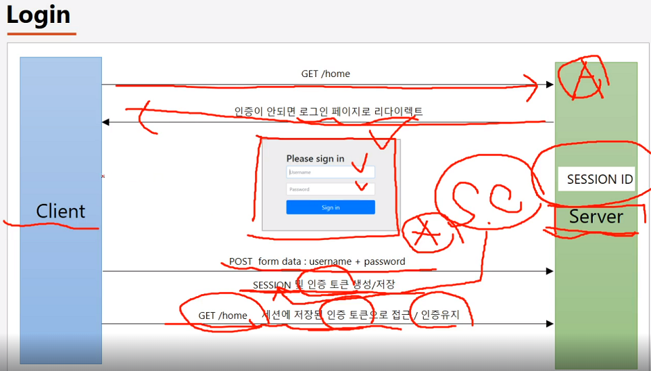
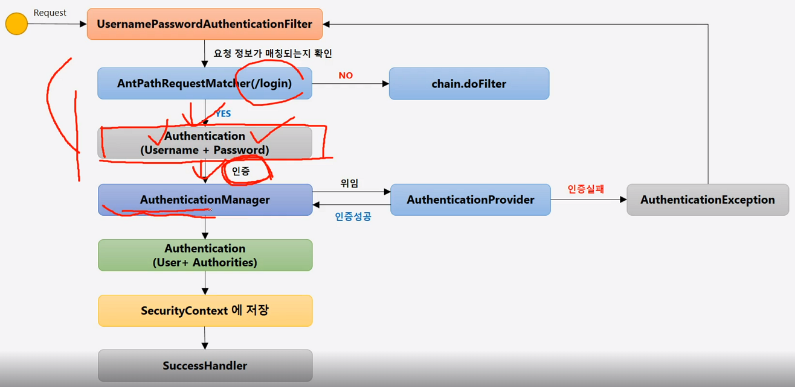
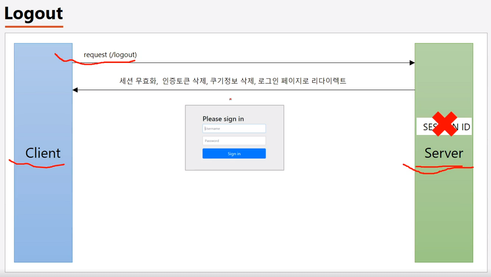
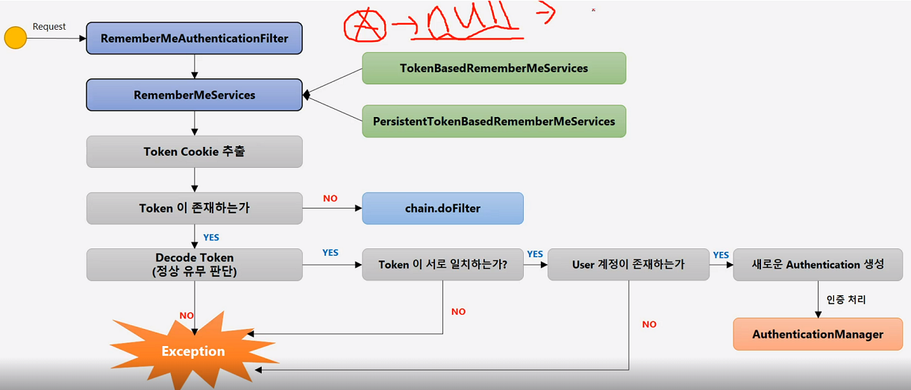
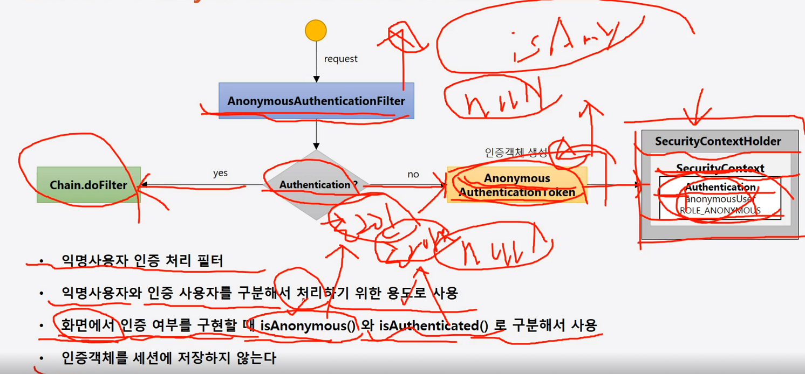
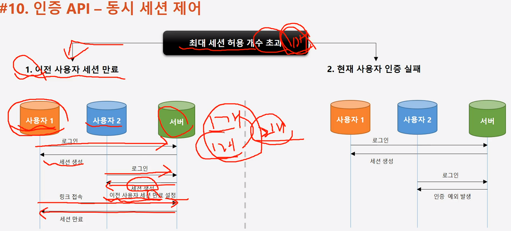
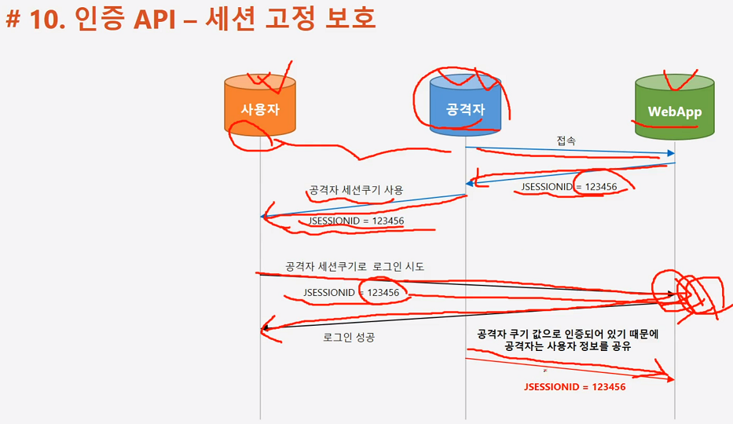

#### 240208

## Client-Server 간 Form Login 과정



 1. Cl → Serv로 url 전송
 2. 인증이 없으면 로그인 페이지로 redirect
 3. 사용자 로그인
 4. id/pass 확인 후, 서버 세션 생성 및 인증 객체 (SecurityContext)를 생성, 세션에 저장함.
 5. 사용자는 인증 토큰을 받아 접근 / 인증 가능

## Login Form 인증 절차



 - ID/PW 값이 오면 Filter가 제일 먼저 받고, 인증 객체를 생성하여 Manager에게 전달한다. (실제 인증은 AuthProvider가 진행)

 - Provider는 인증 성공 시, Manager에게 결과 전달

 - 최종 인증 객체를 SecurityContext에 저장 → 세션 저장

 - :star:AuthManager + AuthProvider:star: 객체 중요!

## Dependency Issue

 - Dependency에 web이 아닌 webflux를 넣으며 security가 정상작동 되지 않는 이슈가 있었다. (2일 날렸다)

 ```
 
 <dependency>
		<groupId>org.springframework.boot</groupId>
		<artifactId>spring-boot-starter-web</artifactId>
        <!-- 이러니 정상작동이 안되지 	<artifactId>spring-boot-starter-webflux</artifactId>-->
 </dependency>
 ```


## Spring Security 버전 업 이슈

 - 5.x 버전에서 제공했던 것들이 deprecated 되면서 6.x 버전 식 사용법 숙지 필요

    * 1. ConfigurerAdapter Deprecated
    ```
    To-be : FilterChain Bean 등록하여 사용
    @Bean
    public SecurityFilterChain filterChain(HttpSecurity http) throws Exception {
        http
                .authorizeHttpRequests((authz) -> authz
                .anyRequest().authenticated());
        http
                .formLogin(withDefaults());

        return http.build();
    }
    ```
    * 2. loginPage 메소드 방식 변경
    ```
    To-be : formLogin 내부 람다 함수 객체로 다 때려넣는다.
    http
        .formLogin(form -> form
            .loginPage("/login")
            .permitAll()
        ); 
    ```

## LogOut 과정

 

  - logout url 보내면, 위 그림처럼 세션 없애고 SecurityContext 제거하고 로그인 페이지로 리다이렉팅

```
로그아웃 시 세션 해제, login으로 redirect, cookies 해제

http
                .logout(form -> form
                        .logoutUrl("/logout")
                        .logoutSuccessUrl("/login")
                        .addLogoutHandler(new LogoutHandler() {
                            @Override
                            public void logout(HttpServletRequest request, HttpServletResponse response, Authentication authentication) {
                                HttpSession session = request.getSession();
                                session.invalidate();
                            }
                        })
                        .logoutSuccessHandler(new LogoutSuccessHandler() {
                            @Override
                            public void onLogoutSuccess(HttpServletRequest request, HttpServletResponse response, Authentication authentication) throws IOException, ServletException {
                                response.sendRedirect("/login");
                            }
                        })
                        .deleteCookies("remember-me")
                );
```

### Remember-Me ?

 - 세션이 만료되고, 웹 브라우저가 종료된 후에도 앱이 사용자를 기억하는 기능

 - 인증이 되었다 = 서버 입장에서 해당 사용자의 세션이 생성되었으며, 그 세션이 성공한 인증 객체를 담고있는 상태다.

 - 서버는 세션 생성 시 세션 id를 응답 필드에 실어 클라에게 보냄.

 - 다시 클라가 서버에 접속하게 되면 서버는 클라가 가진 세션 id를 조회하여, 거기에 인증 객체가 존재하니까 인증하지 않아도 됨.

 ```
 Remember-Me 기능 해제 후, 로그인 했다면

 클라는 서버의 세션id를 가지고 있을 것이다. 만약 클라가 이 id를 강제삭제 후, 재접속 (localhost:8080) 하면 다시 로그인 해야 할 것이다.

 Remember-Me 기능 체크 후, 로그인 했다면?

 서버의 세션 id뿐만 아니라 Remember-Me Cookie도 발급된다. Cookie의 expired date 전까지 서버는 세션 id가 없어도 Cookie가 있으므로 인증하지 않고 접속 가능하다

 ```

 > Remember Me 인증 과정

 

 - 인증 객체가 null일 경우 = SecurityContext 안에 인증 객체가 없단 얘기지. = :star:**세션 만료일 경우 or Remember Me Cookie 존재할 경우일 때 Remember Me Filter가 동작**:star:한다. 인증 객체가 있다면 동작하지 않음.

 - 조건에 만족한다면, 사용자의 토큰과 내가 가진 토큰이 맞는지 비교한다. (DB 접근)

 - 토큰이 같더라도 토큰과 매칭된 User 정보가 존재하는지 확인.

 - Auth 객체 생성하고, AuthManager에 전달함.

 > Anonymous 사용자 인증

 
  - 인증 객체를 세션에 저장하지 않는게 핵심!

 > 동시 세션 제어 전략

 
 ``` 
  sessionManagement() 라는게 있다.
  .maximumSessions(1) // 최대 허용 가능 세션 수
  .maxSessionsPreventsLogin(true) // 동시 로그인 차단, false : 기존 세션 만료
  .invalidSessionUrl("/invalid") // 세션 유효하지 않을 때 이동
  .expiredUrl("/expired") // 세션 만료 때 이동
 ```

> 세션 고정 보호



- 공격자가 받은 sessionID를 사용자에게 전달하여, 사용자가 이를 통해 정상 로그인을 하게 되면 공격자 역시 사용자의 sessionID를 아니까 인증 객체를 가져올 수 있는 위험이 있다.

- 그래서 Security는, 인증할 때마다 새로운 세션 id를 생성하여 이 공격으로부터 보호할 수 있다.

- sessionManagement().sessionFixation()
  * 1. .changeSessionId();
  * 2. none() : 세션 변경 X, 공격에 취약
  * 3. migrateSession() : 기존 세션 설정들 옮김
  * 4. newSession() : 새로운 세션 생성


