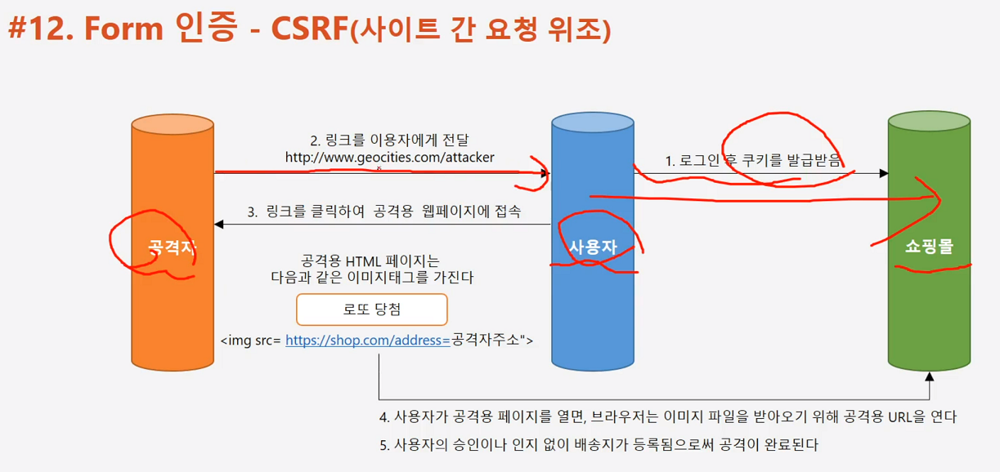
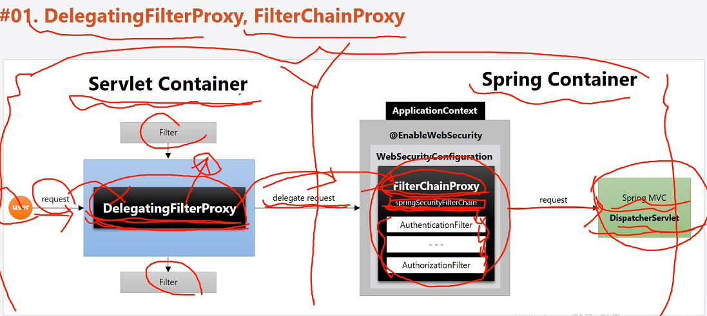

#### 240209

## 인가 정책 및 권한 설정

- URL 방식과 Annotation 방식 중 URL 방식 사용

    * antMatcher("/shop/**") : 특정 경로와 일치하면 인가 설정
    * antMachers("/shop/mypage").hasRole("USER") : /shop/mypage 접근 시, USER 권한을 가진 사람만 접근 가능하다.

    * 설정 시, 구체적인 경로가 먼저 오고 그것보다 큰 범위(*)가 뒤로 오도록 해야 한다.

    ```
    auth.inMemoryAuthentication().withUser("admin").password("{noop}1111").roles("ADMIN", "SYS", "USER");
    // admin 권한 가진 친구는 ADMIN, SYS, USER Role을 다 가진다.
    ```

    * 실제는 사용자 DB 연동 등록, 권한도 동적으로 변경 및 제어한다.

```
    * 실 구현은 
    http.authorizeHttpRequests().requestMatchers(
        new AntPathRequestMatcher("/")).permitAll()
        .antMatchers("/shop/**").hasRole("USER")
        .and() (....)
    ) 
```

## Form 인증 시 CSRF 공격 과정



- 1. 사용자는 쇼핑몰 로그인 후, 쿠키를 발급받는다.
- 2. 이후 사용자가 공격자 페이지 클릭을 하면, 공격자가 쇼핑몰에게 자기 파라미터를 넣어 요청하게 되는데 쇼핑몰은 이 요청 인증을 하게 된다. 왜냐면 사용자의 쿠키가 있기 때문.

- 이를 막기 위해 csrfFilter 가 존재한다. (토큰 비교)

## DelegatingFilterProxy

 - 대충 요청이 처음 들어올 때 요청 Filtering 하는 객체 같음.
 - Servlet Container(WAS)가 있고 Spring Container가 있는데, 얘는 Servlet Container에 존재하기에 Bean 주입이 불가능하다.

 - 특정 Bean에게 이 요청을 위임하여, Spring Container에서 처리하도록 한다.

 

 - 특정 이름으로(SpringFilterChain)으로 등록하게 되면, Servlet Container에서 처리하는 DelegatingFilterProxy가 요청 위임한다.


