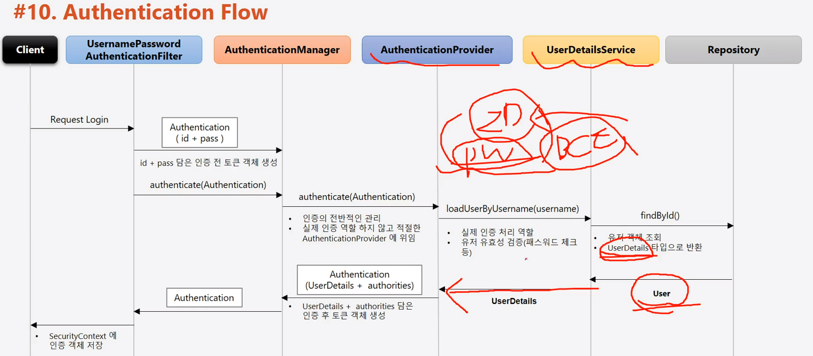

#### 240211

## 인증 절차 이해


> SecurityContext 객체 안에 Auth 객체, Auth 안에 User(id, pw) 객체 저장

> 인증 완료 시, SecurityContext는 HttpSession에 저장되어 전역 참조 가능.

- Login 시, HttpSession에 저장되기까지 흐름도, ThreadLocal 사용


```
@GetMapping("/")
public String index(HttpSession session) {
    // 아래와 같이 인증 완료한 객체를 Controller에서 쓸 수 있다.
    Authentication authentication = SecurityContextHolder.getContext().getAuthentication();

    // 2. Session 객체에서도 참조 가능하다.
    SecurityContext context = (SecurityContext)session.getAttribute(HttpSessionSecurityContextRepository.SPRING_SECURITY_CONTEXT_KEY);
    Authentication authentication2 = context.getAuthentication();
}
```

> Spring에서 Thread 사용 방법

```
@GetMapping("/thread")
public String thread(){
    new Thread(
        new Runnable(){
            @Override
            public void run(){
                Authentication auth = SecurityContextHolder.getContext().getAuthentication();
            }
        }
    ).start();
    return "Thread"; 
}
```

## 인증 시, 각 Class 별 인증 Flow



1. Filter가 id+pass를 담아 Manager에게 인증을 맡김
2. Manager는 적절한 Provider를 찾아 위임 (Form, RememberMe, OAuth에 따라 Provider가 다름)
3. Provider에서 패스워드 포멧에 맞는지 유효성 검증을 한다.
4. ID는 UserDetailsService에 위임하고, Service는 DB에 id있는지 조회.

## 인가 절차


 - 위 그림처럼 url 기반 인가가 있고, 메소드 접근 관점이 있고 객체 사용 관점의 인가가 있다. 즉, 해당 접근 가능한 권한에 맞는 Role을 갖고 있어야 한다는 의미.