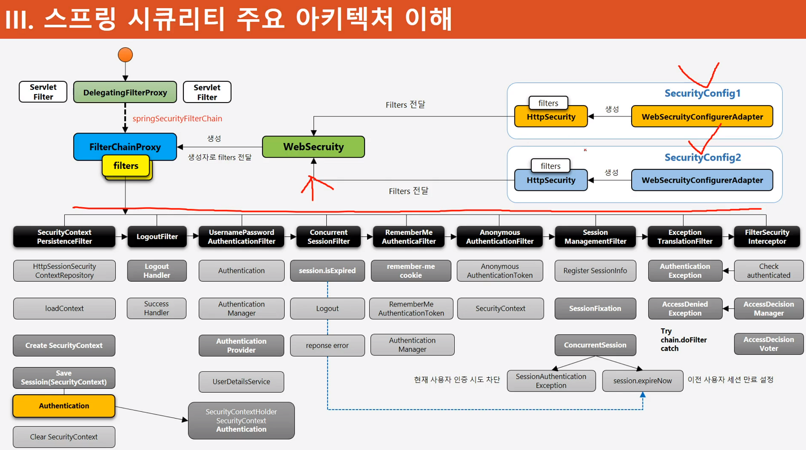
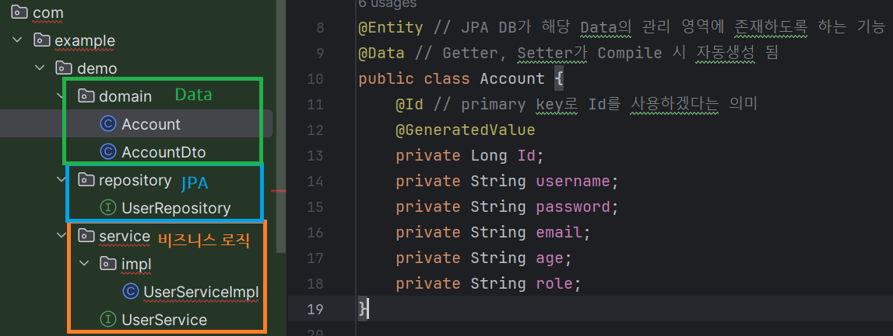

#### 240212

## Security Architecture



1. SecurityConfig에 지정한 것들은 Filter가 되어, init 시 FilterChainProxy에 들어간다.

2. 사용자의 요청을 DelegatingFilterProxy가 제일 먼저 받고, filterChain Bean이 있다면 이를 FilterChainProxy에 위임한다.

3. SecurityContext에 인증 객체가 있는지 보고, 없다면 인증 객체 생성한다.

4. AuthProvider는 사용자의 id/pw를 UserDetailsService를 통해 조회 후, 완료 시 인증 객체를 Context에 넣어준다.

5. 동일 세션이 여러개 존재하는지 확인 후, 있다면 예외처릴 해준다.

6. 이후 접근하고자 하는 자원에 대해, 인가 필터가 작용한다.

> 정적 자원(CSS, js, images)는 보안 필터를 거치지 않도록 예외처리 해줘야 한다.

### 실전 구현 Point



- AccountDTO
```
@Data
public class AccountDto {
    private String username;
    private String password;
    private String email;
    private String age;
    private String role;
}
```

- UserRepository
```
public interface UserRepository extends JpaRepository<Account, Long> {
}
```

- UserService, UserServiceImpl
```
public interface UserService {
    void createUser(Account account);
}
```

```
@Service("userService") // 비즈니스 로직을 수행하는 Component Bean, 루트 컨테이너에 담김
public class UserServiceImpl implements UserService {

    @Autowired
    private UserRepository userRepository;

    @Transactional // 해당 메소드가 Lock 보장이 된다는 의미
    @Override
    public void createUser(Account account){
        userRepository.save(account);
    }
}
```

- 1. [domain] JPA에 담길 Data Class 생성, Entity와 Id, GenVal 설정해야 JPA에 담길 테이블 클래스라는걸 알 수 있다. (엔터티 클래스)

- 2. [repository] JpaRepo 클래스를 상속받을 interface 생성한다. 이때, 위 domain에 엔터티 클래스를 등록한다.
    * IF 사용 장점 : 다중 상속 가능, 
    * IF의 모든 멤버 변수는 public static final
    * 메소드는 public abstract이다.

```
접근 제어자 : public > protected > default > private

public : 패키지에 상관없이 모든 클래스에서 접근 가능
default : 같은 패키지 안의 클래스만 접근 가능
private : 같은 클래스 안에 있는 멤버만 접근 가능
protected : 같은 패키지 안의 모든 클래스와 다른 패키지의 자식 클래스에서 접근 가능

추상 클래스 : 부모 클래스가 가진 기능을 다르게 구현해야 할 때
- 상속받는 클래스의 공통적인 부분을 추상화 시키는데 목적
- 슈퍼 클래스의 기능 이용 및 확장을 위해 사용

// 추상 클래스 (조상 클래스)
abstract class Creature { 
	abstract void swimming(); // 수영 동작을 하는 추상 메소드
}

// 추상 클래스 (부모 클래스)
abstract class Animal extends Creature { }
abstract class Fish extends Creature { }

// 자식 클래스
class Parrot extends Animal {
	void swimming() {} // 앵무새는 수영을 할수 없지만 상속 관계로 인해 강제적으로 메소드를 구현해야하는 사태가 일어난다.
}
class Tiger extends Animal {
	void swimming() {} // 호랑이는 수영을 할수 없지만 상속 관계로 인해 강제적으로 메소드를 구현해야하는 사태가 일어난다.
}
class People extends Animal {
	void swimming() {
    	// ...
    } 
}

class Whale extends Fish {
	void swimming() {
		// ...
    } 
}

출처: https://inpa.tistory.com/entry/JAVA-☕-인터페이스-vs-추상클래스-차이점-완벽-이해하기 [Inpa Dev 👨‍💻:티스토리]

인터페이스 : 그때 그때 필요에 따라 구현하여 자유롭게 붙였다 뗏다 하는 느낌. 구현체의 동일한 동작을 약속하기 위해 사용한다.

abstract class Creature { }

abstract class Animal extends Creature { }
abstract class Fish extends Creature { }

// 수영 동작 추상 메소드를 따로 인터페이스를 만들어 넣는다.
interface Swimmable {
    void swimming();
}

class Tiger extends Animal { }
class Parrot extends Animal { }
class People extends Animal implements Swimmable{ // 인터페이스를 구현함으로써 동작이 필요한 클래스에만 따로 상속에 구애받지않고 묶음
    @Override
    public void swimming() {}
}

class Whale extends Fish implements Swimmable{ // 인터페이스를 구현함으로써 동작이 필요한 클래스에만 따로 상속에 구애받지않고 묶음
    @Override
    public void swimming() {}
}
출처: https://inpa.tistory.com/entry/JAVA-☕-인터페이스-vs-추상클래스-차이점-완벽-이해하기 [Inpa Dev 👨‍💻:티스토리]

```
- 3. [service] 비즈니스 로직을 담당할 인터페이스를 생성한다.
    * 실제 수행할 Impl 클래스 생성하고, Override를 통해 구현한다.

- 4. 어떤 부분을 Override 할까?

    * A. CustomUserDetailsService 에서 유저의 정보와 권한을 각자의 DB에서 얻어오는 과정 구현 (사용자 이름이 실제 DB Table에 있는지 조회하고, 있다면 그 유저가 가진 Role을 List에 담아 반환)

    * B. CustomAuthenticationProvider 에서 Password 일치 여부 확인 후, 맞다면 인증 객체를 반환

    * C. 로그인 페이지 구성 및 로그아웃이나 권한 별 페이지 로딩, 

    * D. 인증 성공 및 실패 시 동작, 인증 거부 동작 조건들

----


### Spring MVC 구조 이해

 - 참조 : https://codevang.tistory.com/248

 - 1. 톰캣(WAS, Servlet Container) 구동
    * server.xml 내부 설정값들에 대한 요청을 제일 먼저 받는다.

 - 2. 루트 컨테이너 생성 (WEB-INF/web.xml, 어플리케이션 컨텍스트)
    * 컨테이너의 종류 : (루트 컨테이너, 서블릿 컨테이너, 커스텀 컨테이너)

    * 서블릿 컨테이너는 루트 컨테이너의 자식이다.

    * 실제 루트 컨테이너 구동 시, 생성과 소멸 주기를 Override하여 원하는 함수를 실행하도록 구성(JNI)되어 있다.

 - 3. servlet-context.xml (서블릿 컨테이너)는, 특정 url에 알맞는 Dispatcher-Servlet을 생성한다. 서블릿 구동 시 파라미터가 servlet-context.xml이라고 보면 된다.

 - 요청 인입 시, url에 매핑된 서블릿을 메모리에 로드시킨다.
 - 요청 하나 당 스레드로 처리하며, 스레드풀은 WAS에서 자체관리한다.

----

### Bean 객체

 - @Controller 시, 서블릿 컨테이너에 Bean 생성됨, 웹 요청/응답 처리용
 - @Repository : DB나 파일같은 I/O 작업 처리, 루트 컨테이너 생성
 - @Service : 로직 처리용,  루트 컨테이너에 생성됨
 - Bean 객체는 데이터 변경이 없는 객체로 사용한다. (VO, DTO 객체는 등록하지 않음, 동기화 이슈)

 - Bean으로 등록해 두면, new로 생성하면 안되고 컨테이너에서 받아와야 한다. 전체 공유가 가능하기에, 의존성 주입(DI, @Autowired)로 객체를 받아와 사용할 수 있다.

 ```
 @Autowired
 private UserService userService; // Service 어노테이션으로 등록한 Bean 객체(전역)을 받아와 쓸 수 있다.
 ```

 > 루트 컨테이너나 서블릿 컨테이너 생성 시, 어노테이션 검색하기때문에 참조 xml 파일에 component-scan 범위가 맞는지 확인해야 한다.

-----

### OOP의 특징
 
 - 출처 : https://sohyeonnn.tistory.com/37#:~:text=%E2%97%BC%20%EC%99%9C%20%ED%81%B4%EB%9E%98%EC%8A%A4%EB%8A%94%20%EB%8B%A8%EC%9D%BC,%EB%A7%8C%20%ED%95%98%EA%B3%A0%20%EC%9E%88%EA%B8%B0%20%EB%95%8C%EB%AC%B8%EC%9E%85%EB%8B%88%EB%8B%A4.

 - 상속, 캡슐화, 다형성, 추상화
 - 재사용성 용이 : 이미 사용한 클래스를 상속받아 수정 가능
 - 메모리 사용과 CPU 시간이 느림 (절차 지향에 비해)

> 추상화
 - 추상 클래스와 인터페이스 존재.

> 캡슐화
 - 데이터 보호를 위한 것

> 상속
 - 기존 클래스 재활용

> 다형성
 - 

### Ajax 인증

 - Login 인증 방식은 동기식 처리지만, Ajax는 비동기식 방식이다.

### JWT 인증

 - 인증 정보를 세션에 담지 않고, 토큰에 담아 표출하는 방식.

### Oauth2, JWT, 마이크로 서비스 인증(Spring Cloud Security)
### ACL (Access Control List)


