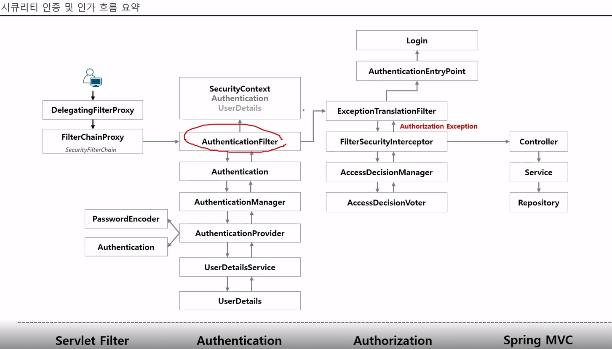
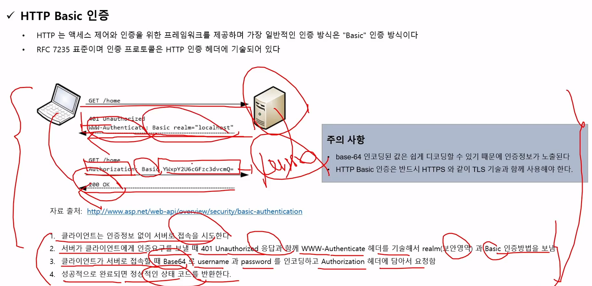
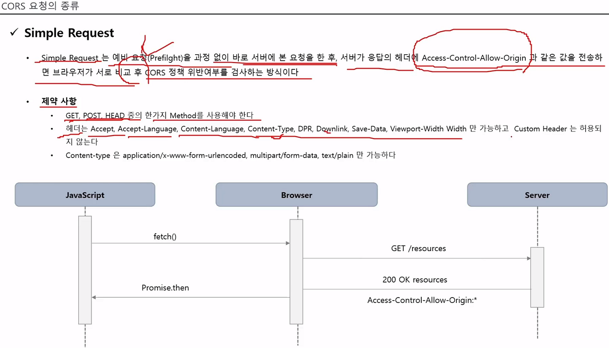
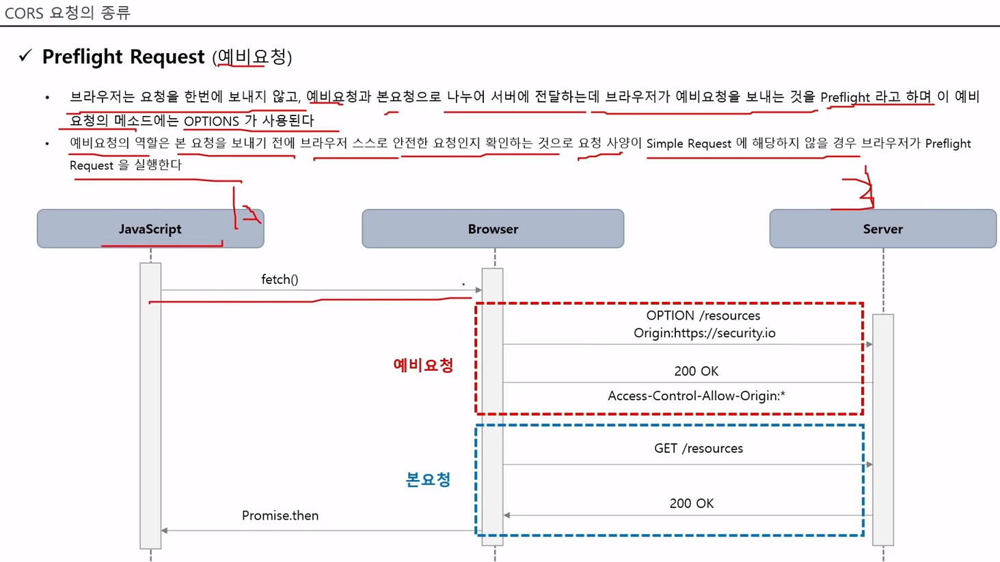
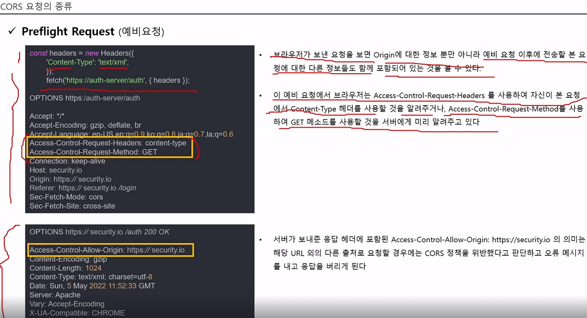
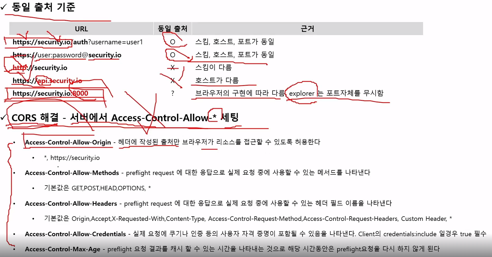
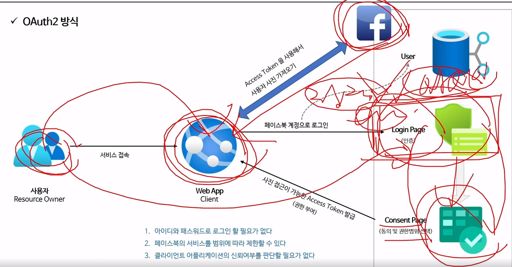

#### 240214

## 인증 및 인가 요약 맵



## Http Basic



 - ID/PW를 base64 인코딩 한다는 것, Https 프로토콜 써야 한다는 것.

 - 기본적으로 인증 객체가 SecurityContext에 저장되고, 이를 Session에 실어 사용자에게 제공된다는 것.

 - 세션을 사용하지 않는 경우, 매 요청마다 인증과정을 거쳐야 함.

```
SecurityFilterChain defaultSecurityFilterChain(HttpSecurity http) throws Exception {
    // 인증을 받아야만
    http.authorizeRequests().anyRequest().authenticated();

    // httpBasic 인증을 하겠다. 만약 위 과정이 없다면 Basic 내 인증과정을 태울 것이다.
    http.httpBasic();
    return http.build();
}
```

## CORS

- Simple Request


- Preflight Request (대부분)






## OAuth 개요




