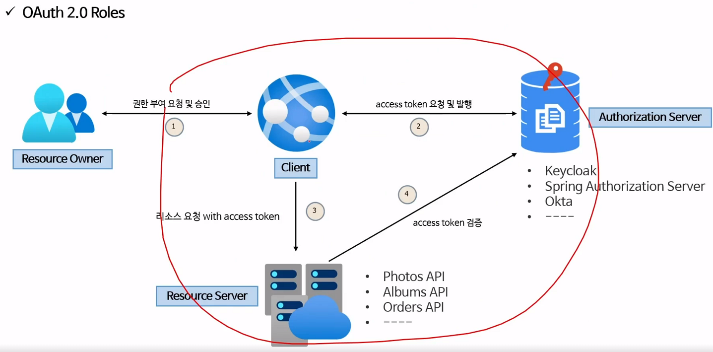
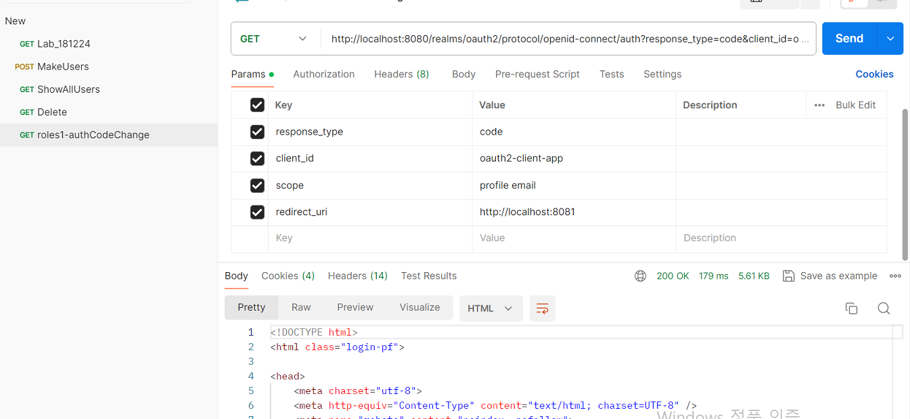
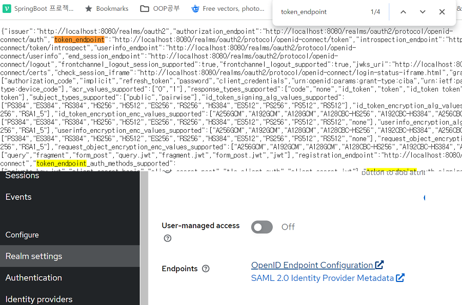
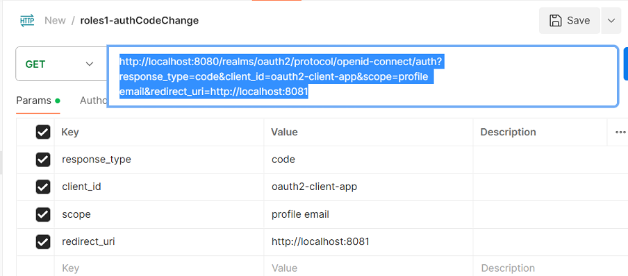
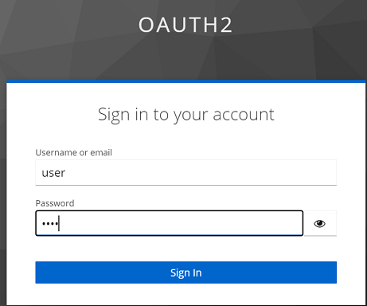
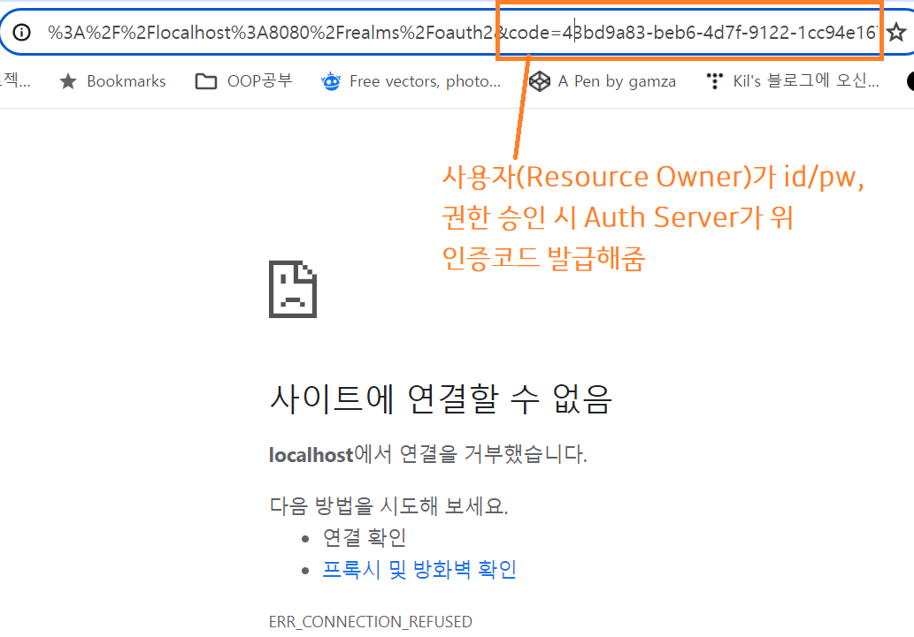
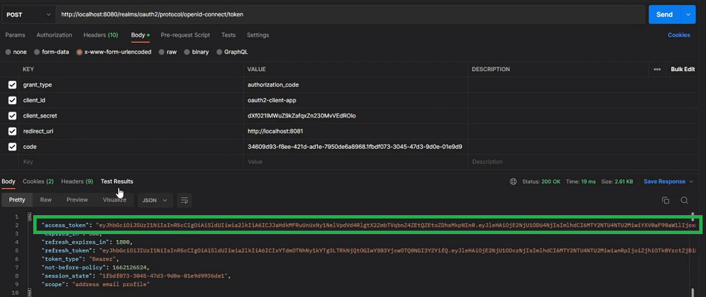
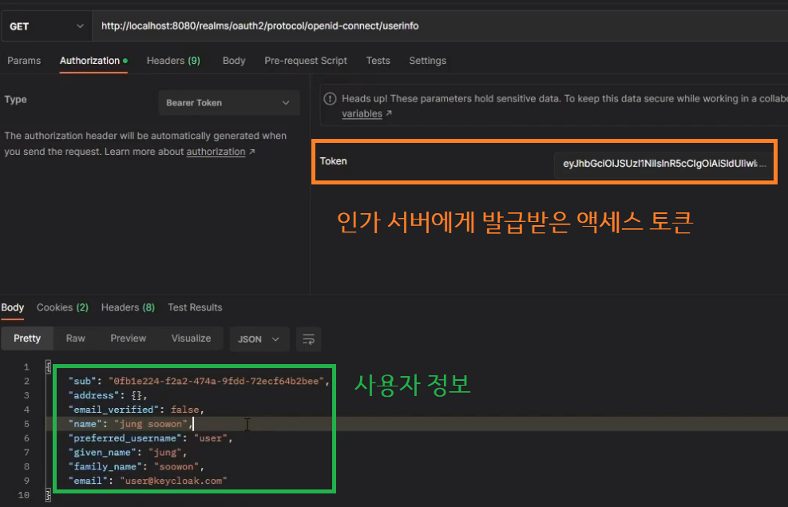

#### 240215

## OAuth 2.0 Roles

## Keycloak

 - 인가 서버 오픈소스로 사용자 연합, 인증, 사용자 관리, 권한 부여 기능 제공

 
 

 1. Postman(Client)가 처음 인가 서버(Keycloak)에게 권한 요청을 한다.

 

 2. 사용자(Resource Owner)는 로그인 한다.

 

 3. 로그인 하고 인가 권한 ok 시, 인가 서버는 클라이언트에게 authCode(임시 코드) 전달
 - 사용자야, 나 인가 서버인데 클라에게 권한 줘도 돼? ok. 
  

 4. 클라이언트는 인가 서버에게 임시 코드와 갖가지 정보를 다시 post로 요청하여, 본격적인 인증 토큰을 받아낸다.

 

 5. 이 인증 토큰을 가지고 클라이언트는, 사용자의 정보를 인가 서버나 리소스 서버에게 요청하여 가지고 온다.

 

#### Q. 그럼 클라이언트가 리소스 서버에 API Call을 할때마다 토큰 검증을 해야 하는건가?
