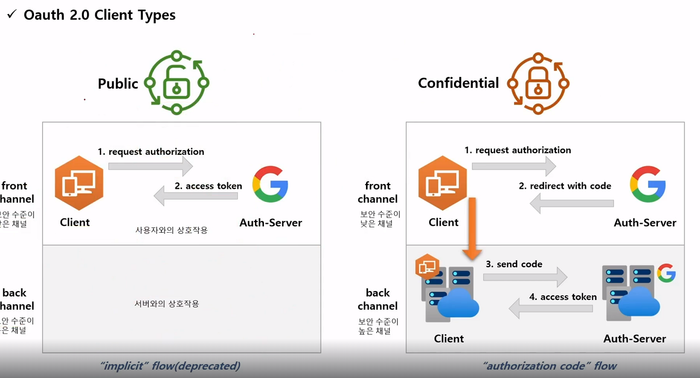
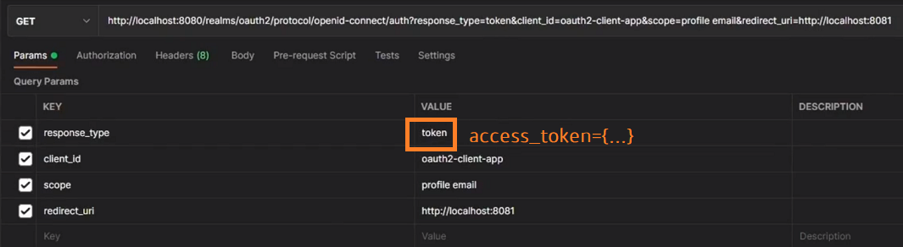
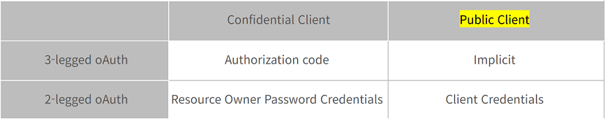
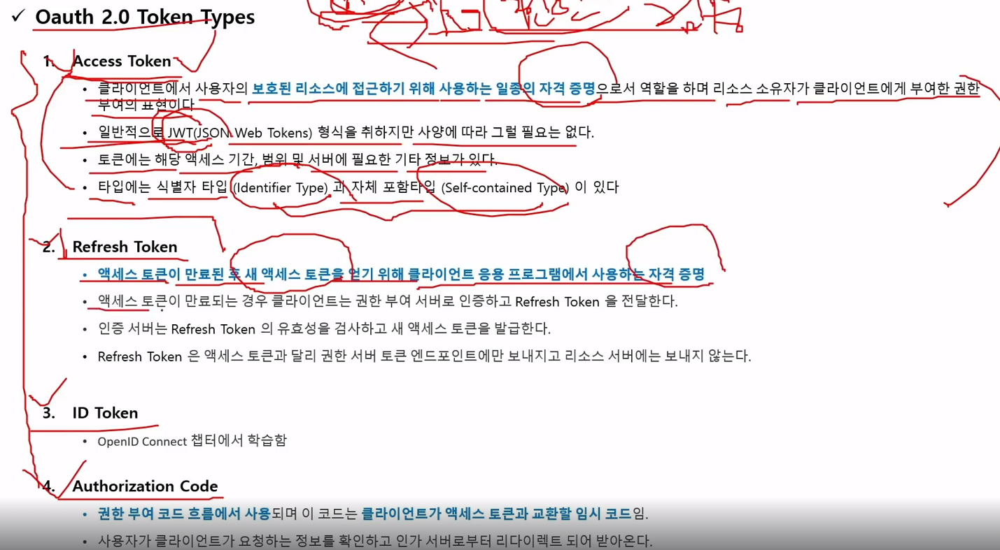
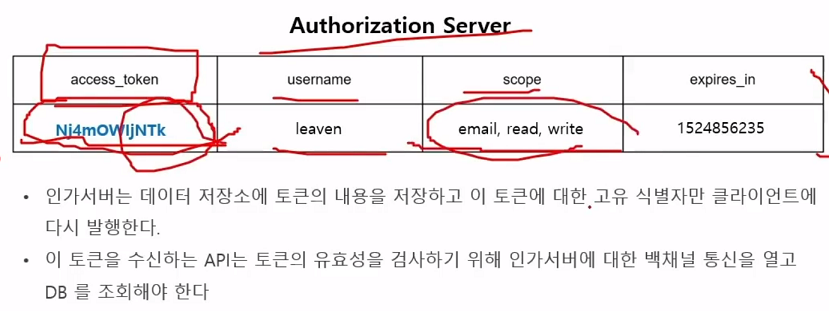
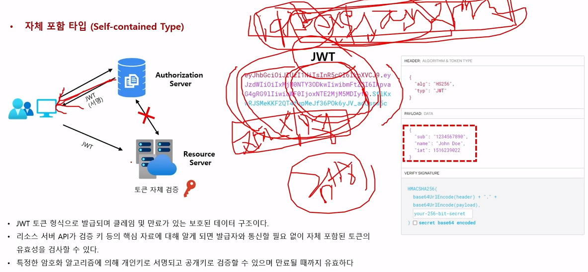

#### 240216

## Client Types

> Public Client vs Confidential Client

 * Public Client: 사용자의 id만으로 Auth-Server에 Access-token을 발급받을 수 있는 Client

    
    - Client Secret 없이 오로지 Client id와 res_type만 token으로 바꿔도 Access-token을 알 수 있다.

 * Confidential Client : 위 그림처럼 요청 시 바로 Access Token을 주는게 아니라 Auth Code를 전달 후, Client의 back 단에서 [Client Secret Key + Auth Code + ID]를 다시 Auth Server에 전달하여 최종적으로 Access Token을 받아오는 형식이다.
  - 기밀 client는 back 단에서 이뤄짐을 명심하자
  - 왜 이걸 쓰냐면, Public으로 할때 Code가 url에 노출되기 때문.
  - 만약, Implicit flow를 쓰다가 Access Token을 중간에 탈취당하면? 나도 모르는 새 내 쇼핑몰엔 이상한 물품들이 결제가 되어있다.

## Authentication Flow 4개

 - Standard flow (Auth Code 형식)

 - Direct access grants

 - Implicit flow

 - Service accounts roles

 

## Token Types

 - Access Token이 사용하지 못할 경우, Refresh Token을 주고, 인가 서버가 유효성 통과 시 다시 Access Token을 보내줌

 - 실제 인증 요청이 오거나, Refresh Token이 올 때 Access Token을 JWT 방식으로 전달한다.

 - Access Token은 Auth Server나 Resource Server에 둘 다 보내는데, Refresh Token은 오로지 Auth Server에만 보낸다. (Resource Server :X: ) 

> 실제 Auth Server의 DB에 저장되는 Table

- Resource Server로부터 Token이 정당한지 검증 요청이 오겠구나.

## Access Token 종류

 - 식별자 타입 (리소스 서버가 이 토큰을 이용해 주기적으로 인가 서버에 검증 요청함)

 - 자체 포함 타입

 

  - 전자서명을 한 Access Token을 발급하는 토큰, 이건 Resource Server에서 전자서명된 토큰에 대한 검증만 가능(리소스 서버 자체 검증함)하면 **Auth Server에 토큰 검증 여부를 하지 않아도 되며, 네트웍 통신을 아낄 수 있다**

## Auth Server가 하는 일

 - 임시 코드 발급
 - 액세스 토큰 발급
 - Refresh Token 요청 시 Access Token 발급
 - 리소스 서버로부터 Token 검증 요청 해줌 (식별자 액세스 토큰 타입일 때)

## 권한 부여 유형

