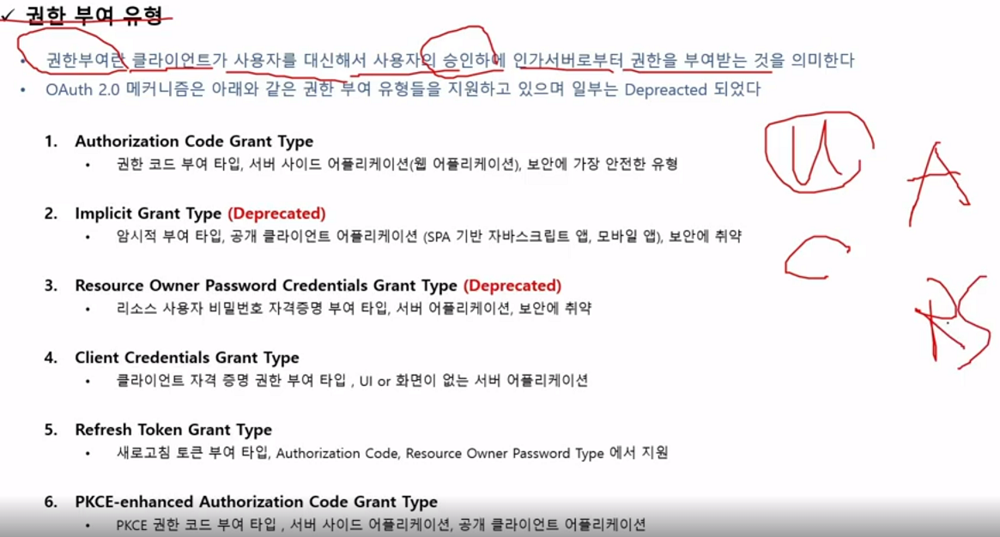
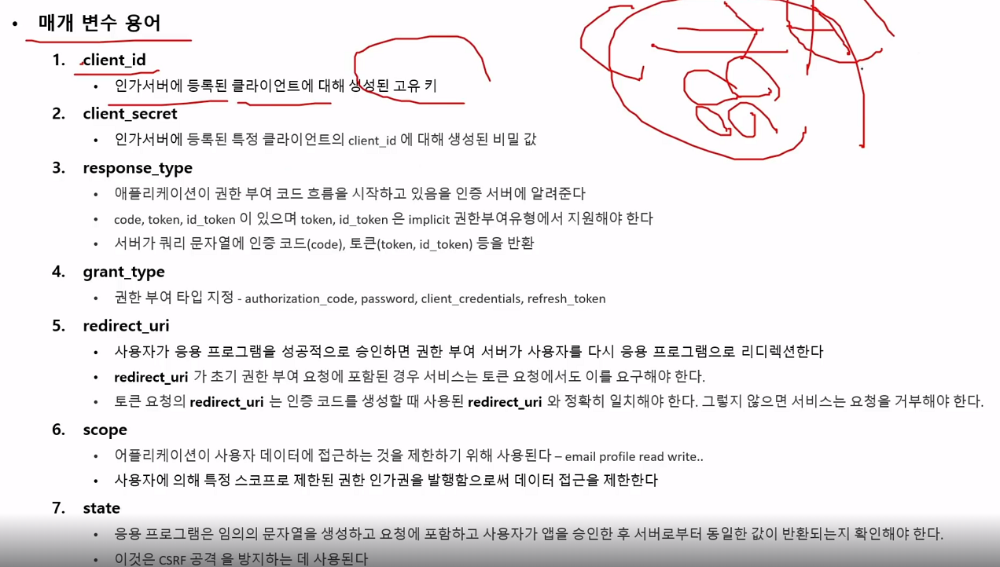

#### 240217

## 권한 부여 유형

- Authorization Code Grant Type

    * 가장 안전한 권한 부여 유형이며, Auth Code(임시 코드)를 인가 서버 → 클라이언트에게 넘겨줄 때, 사용자의 권한 동의가 있어야 비로소 액세스 토큰 발급 해준다.

- Implicit Grant Type
    * SPA 기반 자바스크립트 앱이나, 모바일 앱은 코드가 노출되기에 위험..

 - redirect_uri에 토큰 요청의 uri와 인증 코드 생성 시 uri는 같아야 한다.

