#### 240229

### Auth Code Grant Type

 - 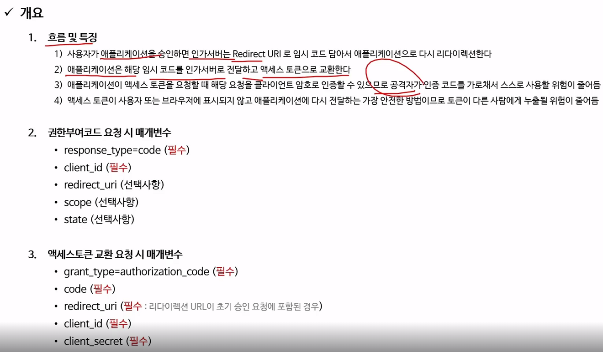

 - 클라이언트가 인가 서버에게 토큰을 요청할 때, 사용자의 ID/PW가 맞는지 확인하는 자격 증명이 통과되어야 토큰을 준다. 그러기에, 공격자가 중간에 임시 코드를 뺏더라도 자격 증명에서 걸리니까 안전한 방식이다.

- 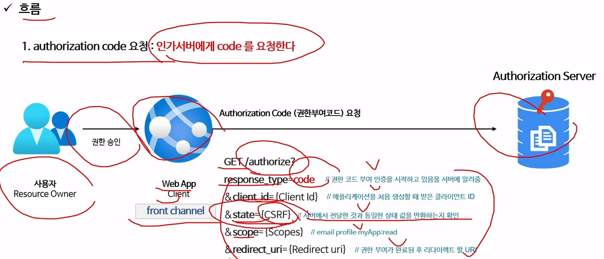

- 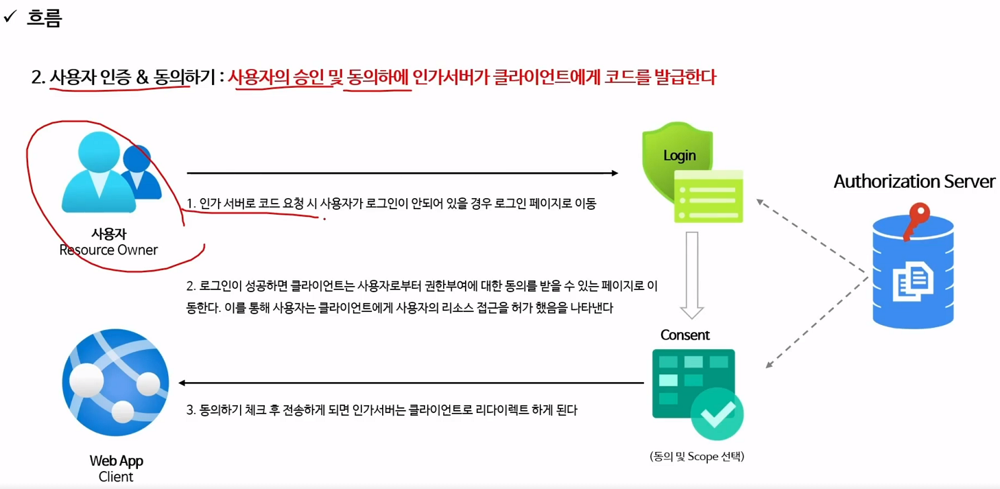

- 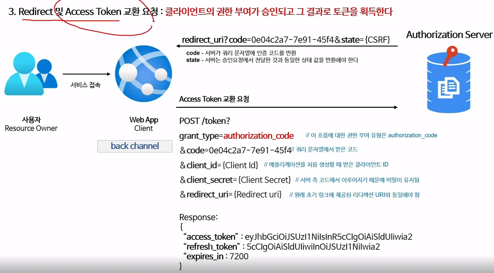

- 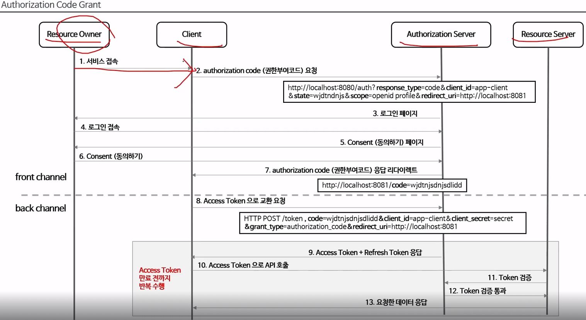

### Implicit Grant Type

 - 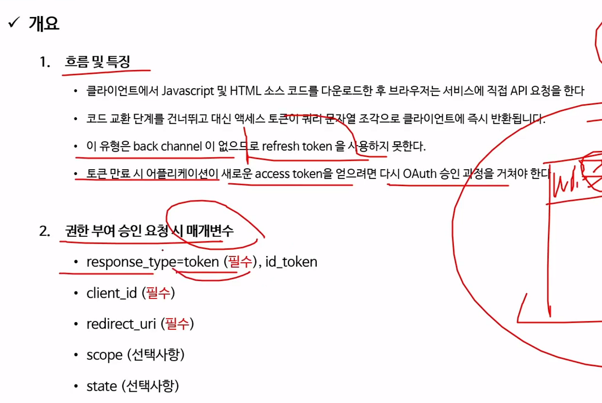

 - 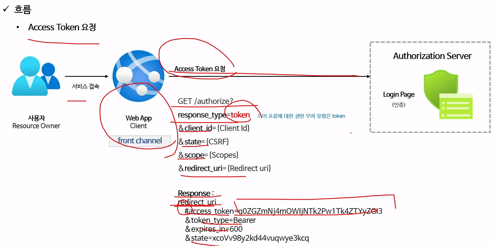

 - 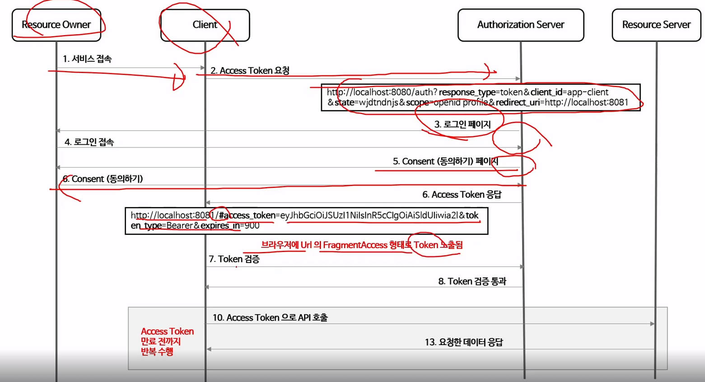

### Resource Owner Password Credentials Grant Type

 - 패스워드 자격증명 승인 방식이며, 클라이언트가 서버에게 ID/PW를 주면 서버는 인증해서 Access Token을 주는 방식이다.

 - 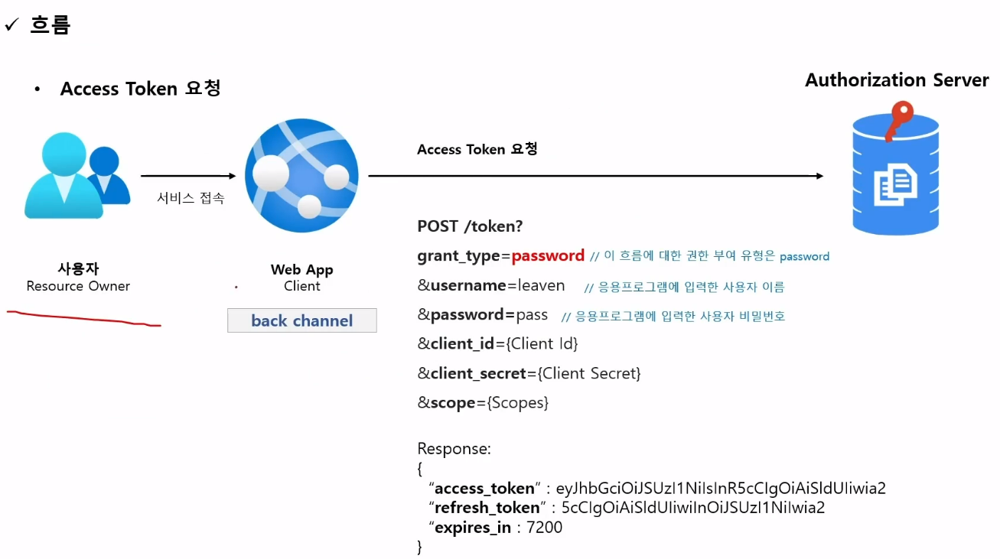

### Client Credentials Grant Type

 - 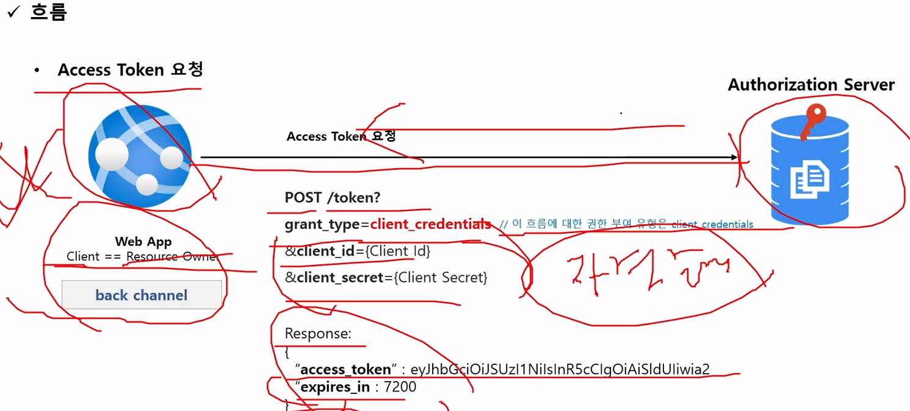

 - 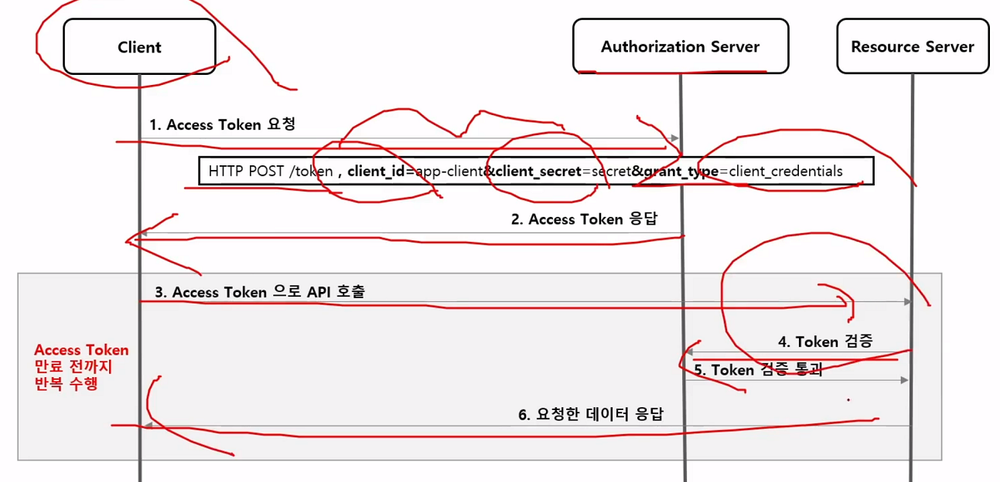

### Refresh Token Grant Type

 - 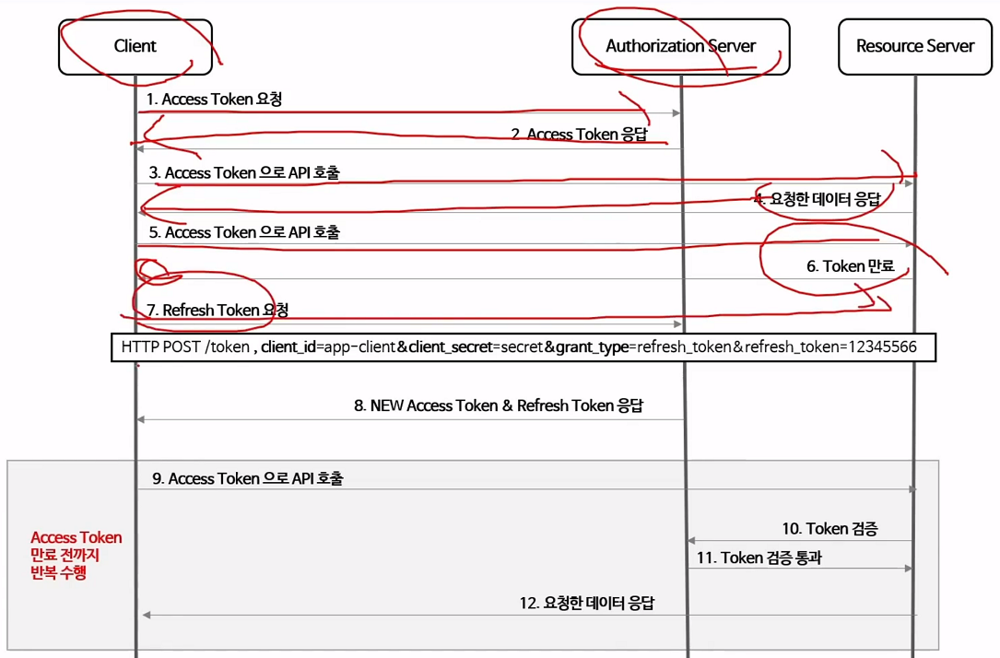
 - refresh_token을 보내면 새로운 access_token을 받아온다. (단, refresh_token expired 되지 않았다면!)

### PKCE-enhanced Auth Code Grant Type

 - 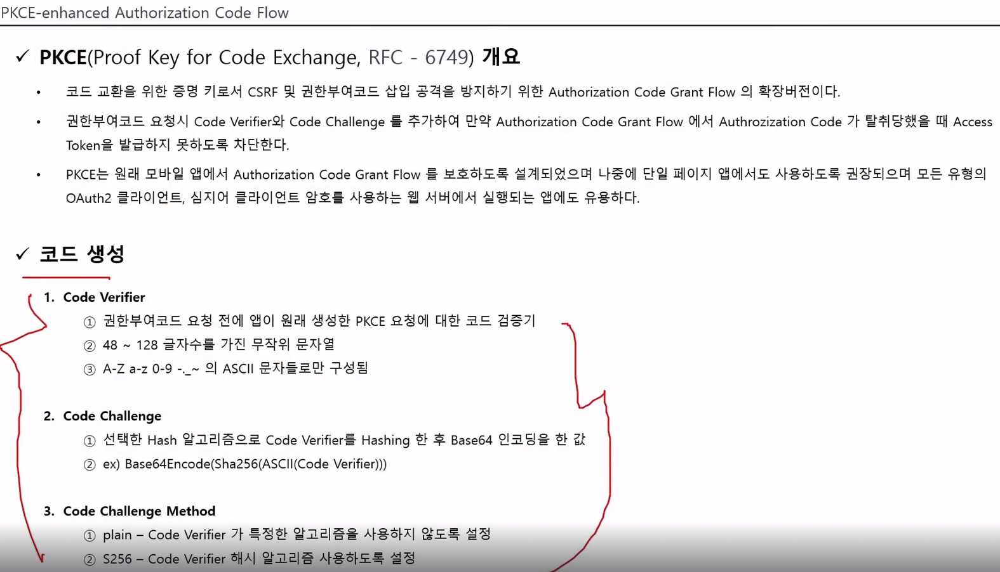

 - 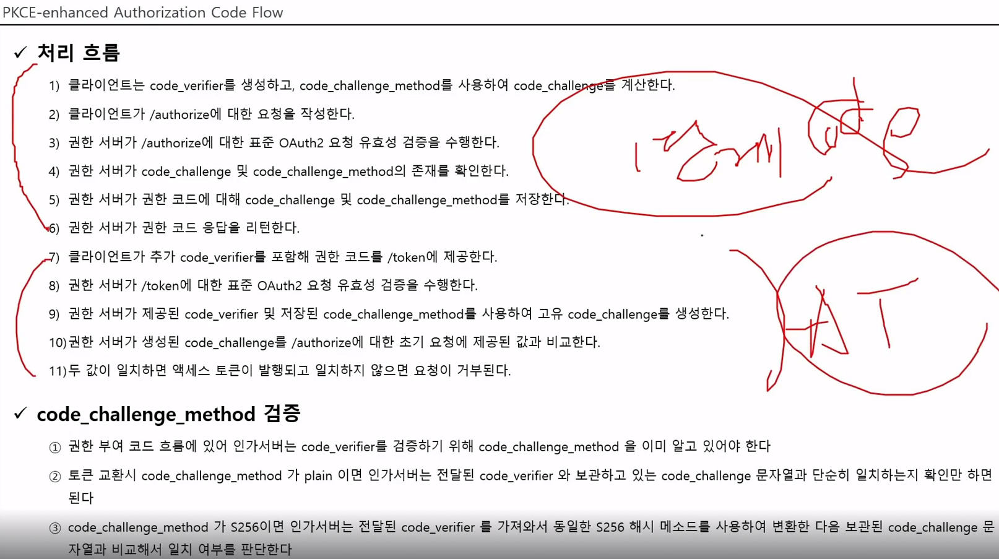

### OpenID Connect

 - OIDC 1.0은 OAuth 2.0을 위해 구축된 ID 계층,
 - scope 지정 시 openid를 포함하면 OIDC 사용이 가능하며, 인증 정보는 ID 토큰이라고 하는 JWT 형태로 반환된다.

 - OIDC는 인증 전용 프로토콜이며, 반환값은 ID Token이다. 즉, 사용자 정보를 반환받는데 이 토큰으로 인증 처리를 바로 해버리고, 나머지 OAuth 2.0으로 인가 정보만 이용하는 개념인 것 같다. 기존 OAuth만 이용했을 때에는 코드 받아오고 액세스 토큰 받아오고 그랬는데 그럴 필요가 없다.

 - Access Token은 이 토큰 자체로 인증이 아니다. Access Token을 가지고 Resource Server로 가서 인증처리를 하고 해당하는 자원을 가지고 와야 하는데, OIDC를 통한 ID_Token을 가져왔다면 인증처리를 할 필요가 없다.

 - 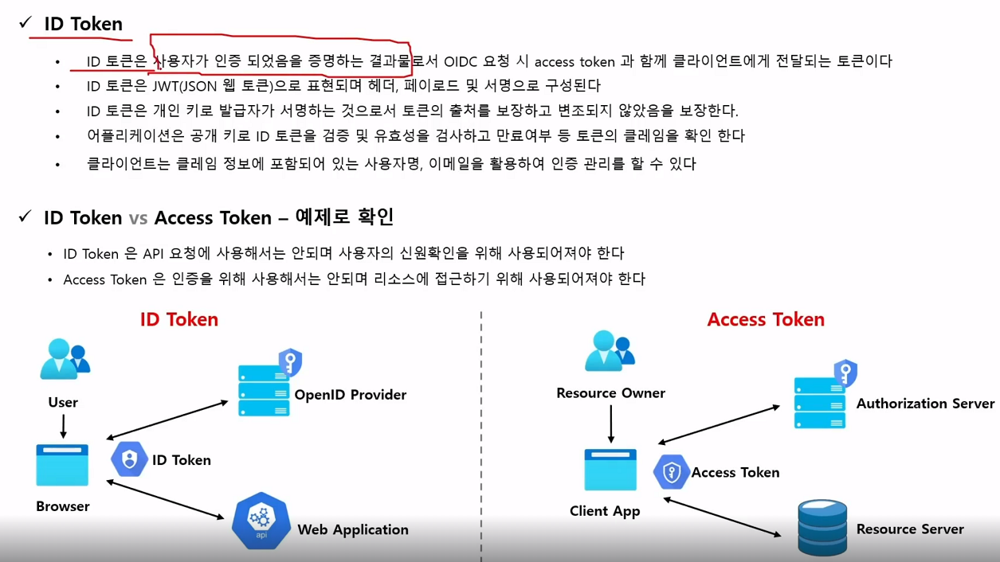

 - ID Token은 인증을 위한 토큰, Access Token은 인가를 위한 토큰.

 - scope에 openid만 적어주면 OIDC 프로토콜이 동작하여, id_token(Header, Payload, Signature) 항목이 추가되어 응답받는다.

 - response_type에 id_token, token(Access token), code(임시 코드)를 입력할 수 있다.