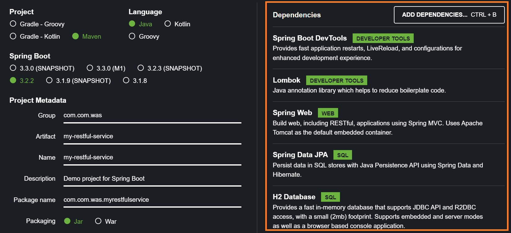
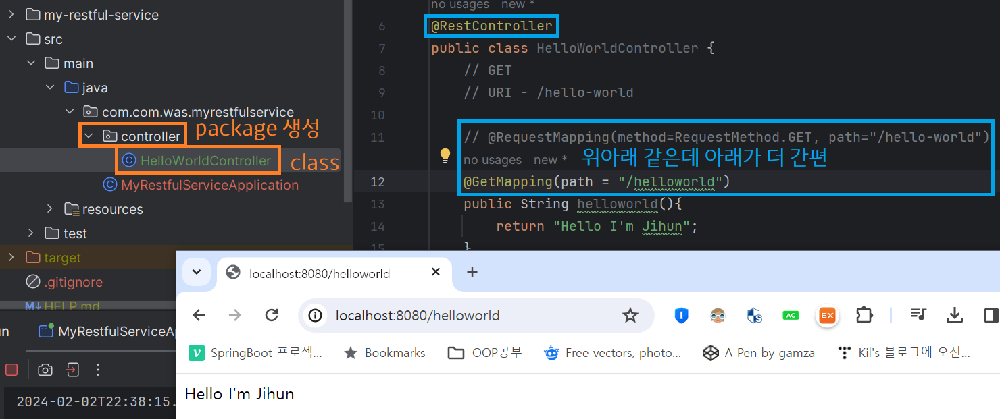
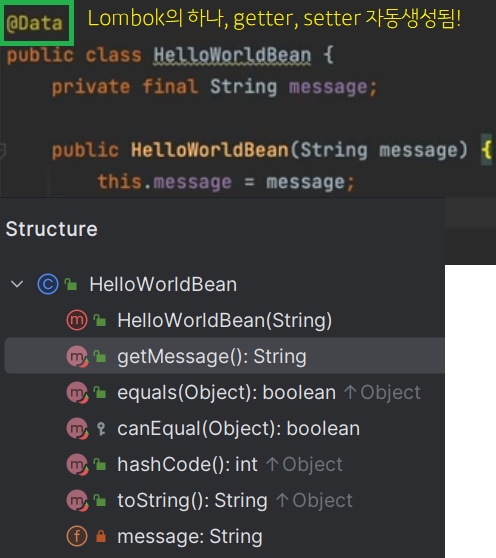
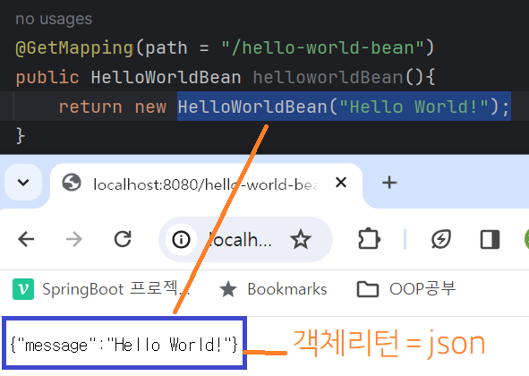
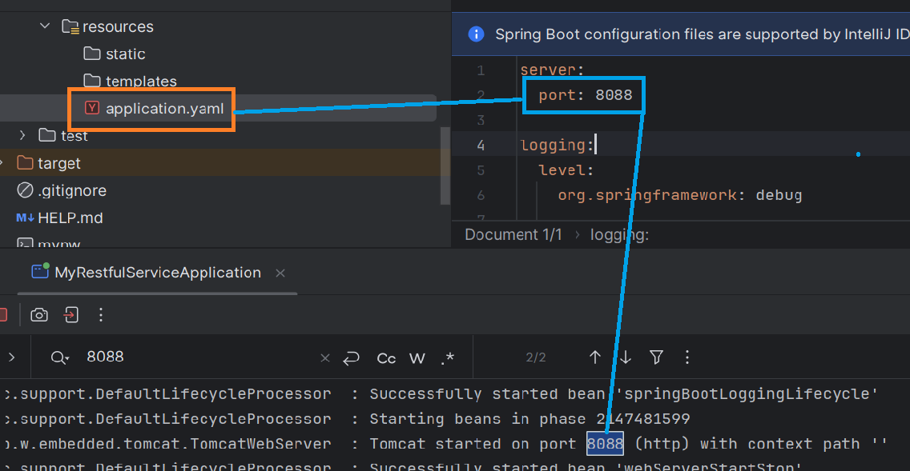
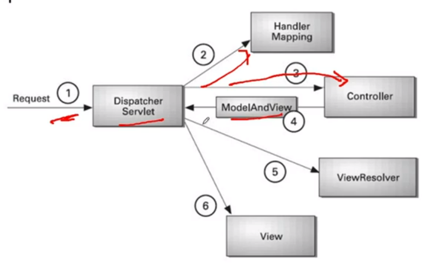
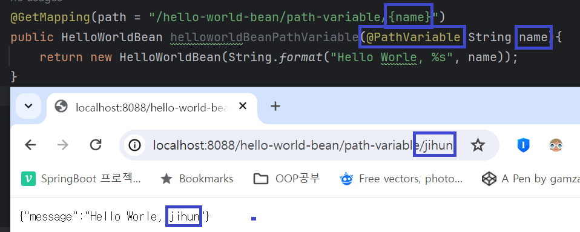

#### 240202

Theme 1. SOAP vs Rest

- SOAP (Simple Object Access Protocol)
    * XML 방식의 프로토콜을 가지고 통신하는 방식. 무겁고 느린게 가장 큰 단점이라 지금 많이 쓰진 않는다. (오버헤드가 많다)

- REST (REprosentational State Transfer)
    * 컴퓨터-스마트폰 간 정보교환의 매개체인 인터넷을 쉽게 사용하기 위한 인터페이스.

> API = (Application Programming Interface)
> Endpoint = API를 통해 서버가 제공하는 리소스에 접근하기 위해 제공 되는 주소

Theme 2. Spring Boot

 - Spring Framework를 쉽게 사용할 수 있도록 만든 툴.
 - Spring Bean
    * Bean : 예전 자바는 개발자가 직접 클래스의 인스턴스를 만들면 메모리에 적재되고 사용하는 느낌이었는데, 직접 인스턴스를 만들지 않고 Bean에 등록을 해두면 Container가 알아서 사용할 수 있도록 하는 방식이다. 즉, Container는 instance 관리자라고 봐도 된다. (Inversion Of Control, 관리 주체가 개발자가 아닌 Container로 바뀜)
 - initializing
    * spring.initializr 내부 [jar와 war]의 차이는 jar는 내부 톰캣 쓰겠단 의미고 war는 외부 was를 쓰겠단 의미로 보면 된다.
    
    

 - Start
    * @SpringBootApplication 붙으면 시작점이다.
    * Bean 확인 방법
    ```
    @SpringBootApplication
    public class MyRestfulServiceApplication {

        public static void main(String[] args) {
            ApplicationContext ac = SpringApplication.run(MyRestfulServiceApplication.class, args);

            String[] allBeanNames = ac.getBeanDefinitionNames();
            for (String beanName : allBeanNames) {
                System.out.println(beanName);
            }
        }
    }
    ```
    
    

    

    

-------

### Theme 3. Spring Boot 동작 원리

- resources/application.properties or yaml 파일


- Servlet Container : Servlet Application 실행하는 환경

- Dispatcher Servlet : Servlet Container로 들어오는 모든 HTTP 요청을 우선적으로 처리하는 부분 (Gateway와 비슷)



- @RestController
    * return new HelloWorldBean("Hello World"); 하면
    - As-is : ResponseBody에 HelloWorldBean 객체 넣고 반환해야 하는데,
    - To-be : RestController Bean이 있어서 하지 않아도 됨.
- @PathVariable : 가변 url, 변수 url을 만들 수 있다.
 


#### 내일은 User Service API 구현하기

