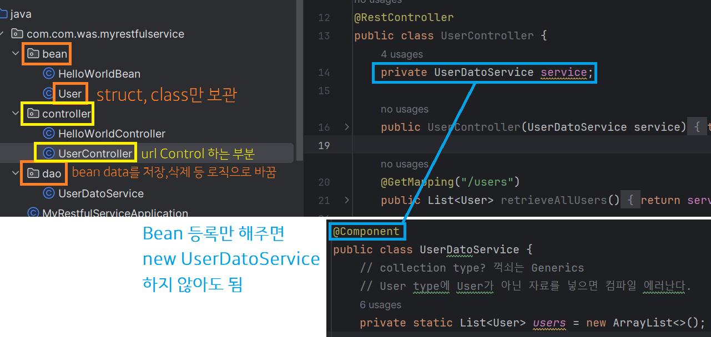

#### 240203

### Theme 4. RESTful에 필요한 Annotation

> Bean 등록의 의미


> 요청 시, 개발자 모드에서 상탯값 확인 방법


> GetMapping, PostMapping으로 같은 url인데 다른 용도로 사용 가능

- PostMapping 시 반환 타입(ResponseEntity), 파라미터(RequestBody) 어노테이션이 자주 들어간다. 잘 봐라


> 특정 상태 코드 응답 (ResponseStatus)


> DeleteMapping 예제


### Theme 5. Validation Check

1. pom.xml에 Lib 추가

```
		<dependency>
			<groupId>org.springframework.boot</groupId>
			<artifactId>spring-boot-starter-test</artifactId>
			<scope>test</scope>
		</dependency>
```


2. Data Class에 여러 Annotation을 붙여 조건 등록

```
    @Size(min = 2, message = "Name은 2글자 이상 입력해 주세요.")
    private String name;

    @Past(message = "등록일은 미래 날짜를 입력하실 수 없습니다.")
    private Date joinDate;
```

3. Controller에서 받을때 @Valid 추가

```
    @PostMapping("/users")
    public ResponseEntity<User> createUser(@Valid @RequestBody User user){
    }
```

> Spring Context가 인스턴스에 의해 기동이 될 때, 해당하는 인스턴스를 만들어놓고 메모리에 등록한다. 미리 등록되어진 다른 Spring의 Bean을 가지고와서 현재 클래스에서 사용할 수 있도록 객체를 생성하지 않더라도 참조할 수 있는 형태로 받아오는 것

### Theme 6. 환경 설정 파일 사용

1. message.properties 내 greeting.message=Hello 변수를 이용하여, Header의 Accpet-Language 값에 따라 다른 properties 내 응답값으로 표출하기.


### Theme 7. 버전 관리

1. Query String 사용

 - localhost:8088/admin/users/1?version=1
 @GetMapping("/users/{id}", params = "version=1")

 - localhost:8088/admin/users/1?version=2
 @GetMapping("/users/{id}", params = "version=2")

2. Header에 설정한 Key-Value를 통한 사용

 - @GetMapping("/users/{id}", headers="X-API-VERSION=2")

 Header값에 위 Key-Value 적으면 각기 다른 메소드 콜됨.

### Theme 8. HATEOAS

 - RESTful로 만드는 REST 앱 아키텍쳐의 제약조건

 - REST API의 설계적 관점에 관해 먼저 알고 들어가자.

 - 응답에 데이터 뿐만 아니라 관련된 가능한 작업도 링크 형식으로 포함된다.
 - 클라 입장에서 호출 가능한 API 정보를 알 수 있다.

 


#### Next : Swagger 이용, 내장 톰캣 Metric 방법, 인증 처리 구현!


 


