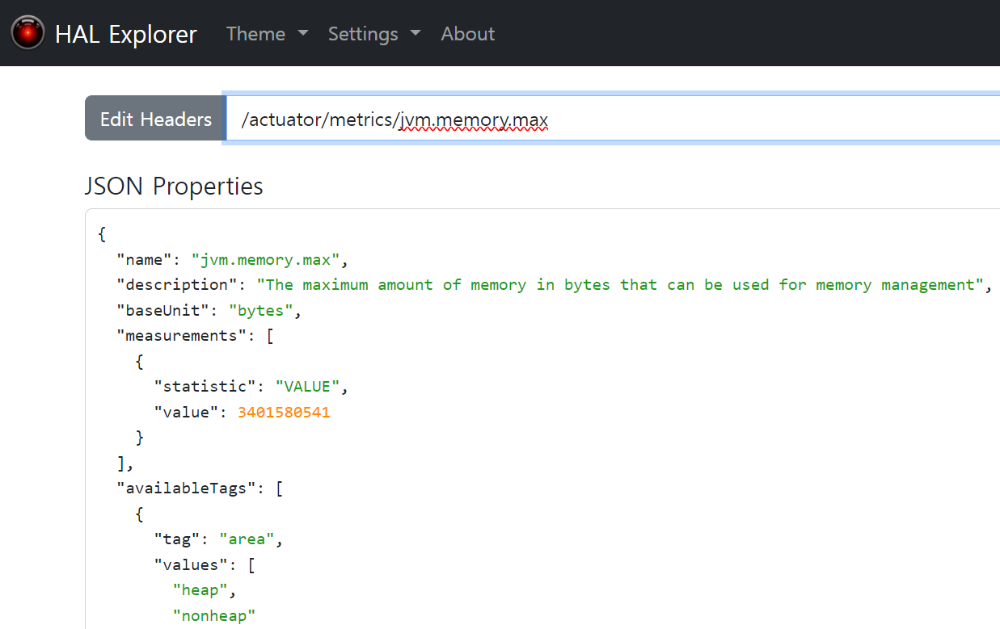
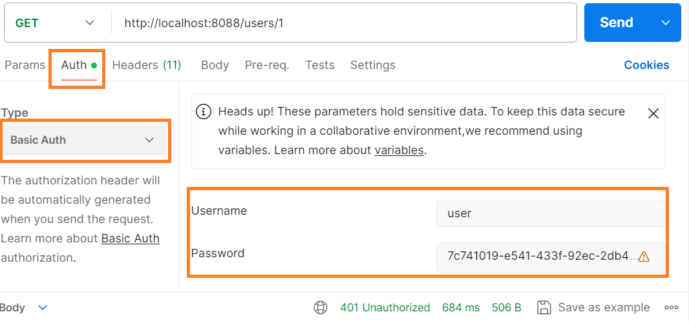
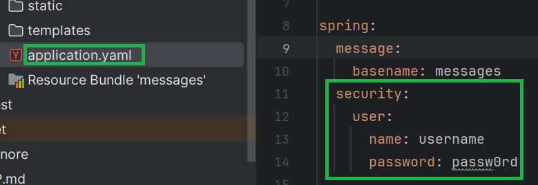
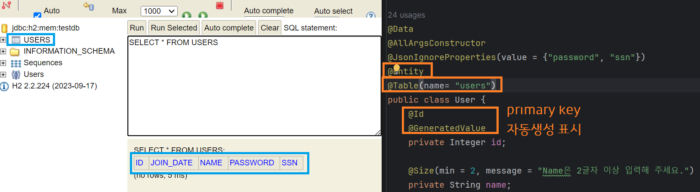
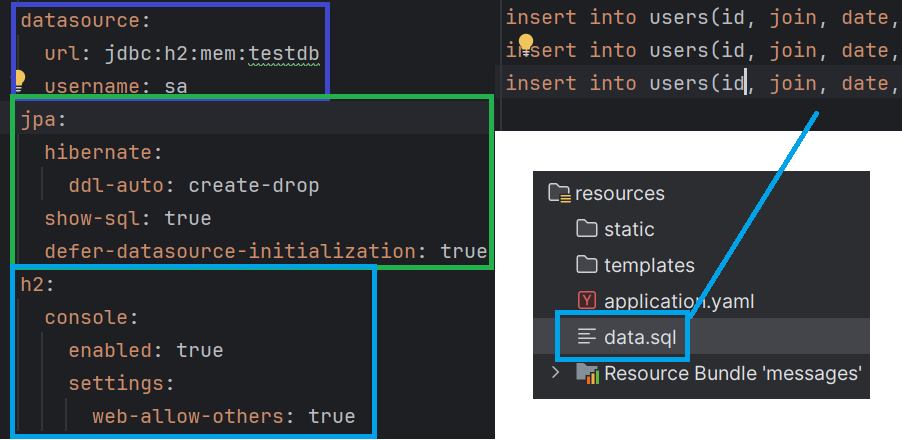

#### 240204

### Theme 9. HAL Browser를 통한 Metric 수집

 - HAL 설치
    * pom.xml에 해당 dependency 추가
 ```
 	<dependency>
		<groupId>org.springframework.data</groupId>
		<artifactId>spring-data-rest-hal-explorer</artifactId>
	</dependency>
 ```
 - localhost:8088/ 접속 시 화면
 

### Theme 10. Spring Security

 > RESTful API 인증 처리를 위한 방법

 - OAuth, Token, id/pass 인증

 > security dependency 추가

 ```
 	<dependency>
		<groupId>org.springframework.boot</groupId>
		<artifactId>spring-boot-starter-security</artifactId>
	</dependency>
 ```

 - 실행 후 pass 확인

 Using generated security password: 7c741019-e541-433f-92ec-1234567

 - 결과 확인

 
 

### Theme 11. JPA

 - JPA는 인터페이스이며, JPA를 구현한 라이브러리가 바로 Hibernate이다.

 - 객체를 Query로 맵핑하는 것이라고 생각하자.

 - JPA 설정을 위한 Annotation
    * @Entity, @Id, @GeneratedValue
    

 - 아래 data.sql에 쿼리 작성 하면 초기 데이터 생성 가능
     


